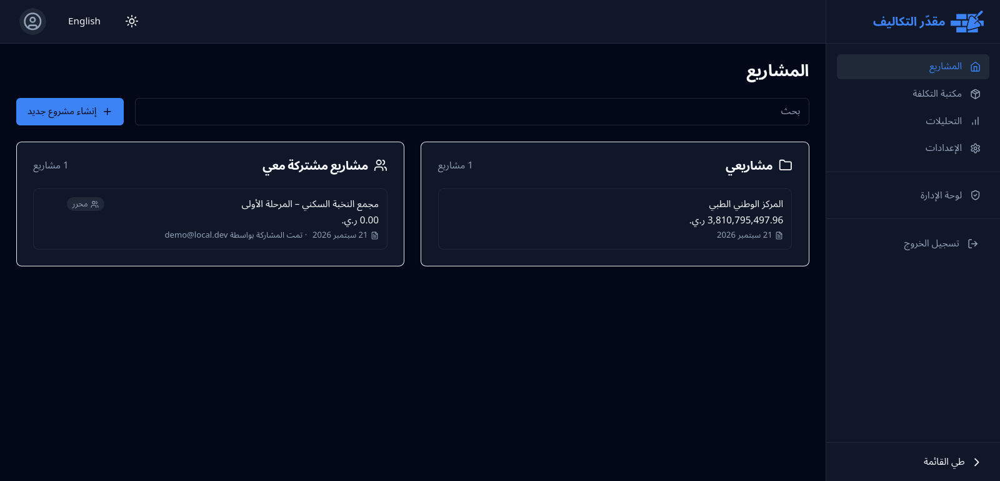
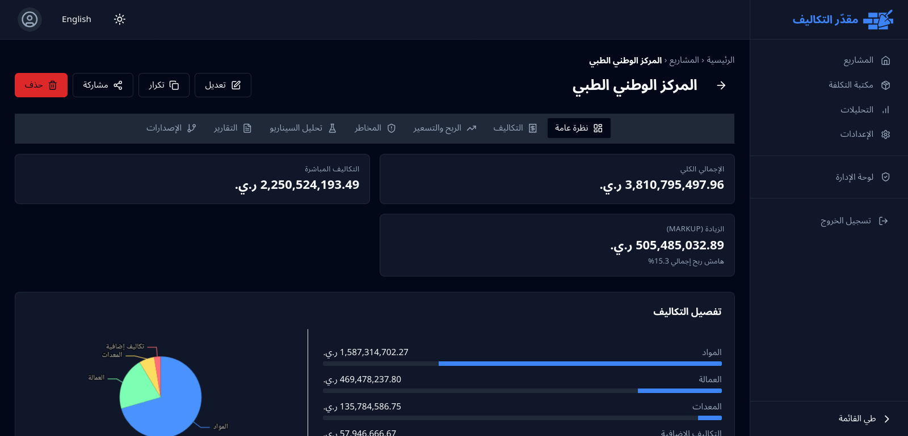
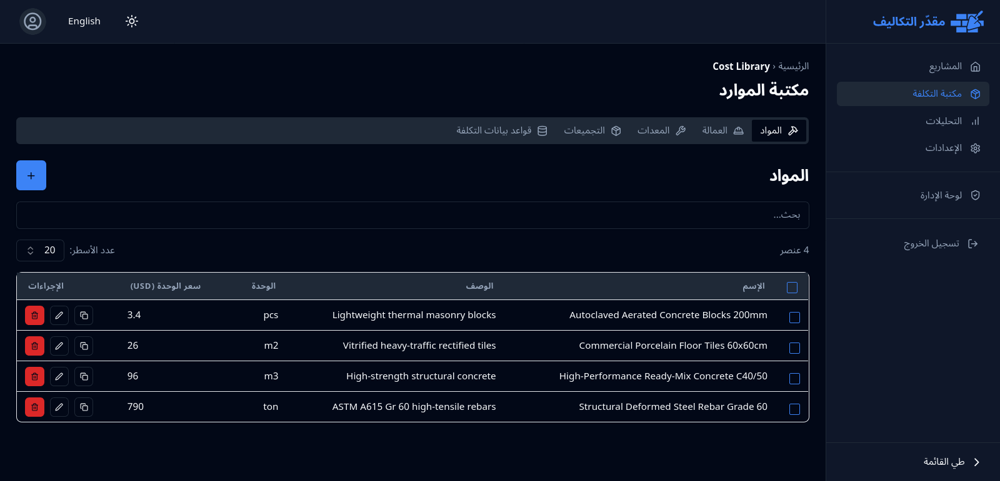
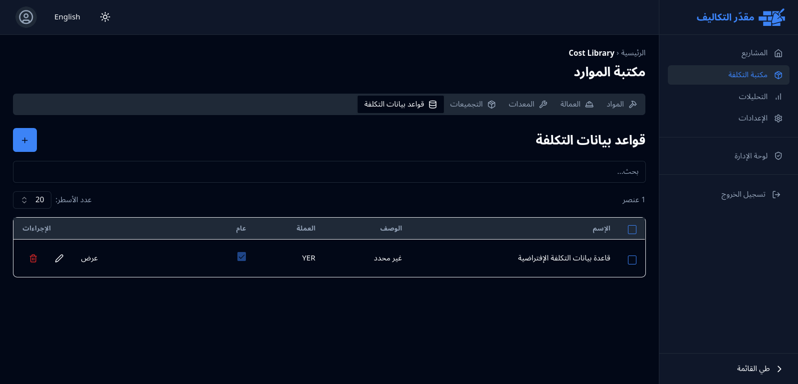
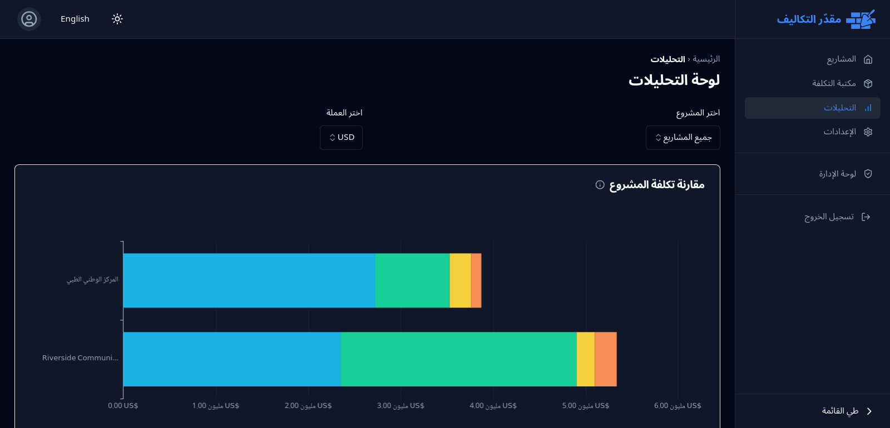
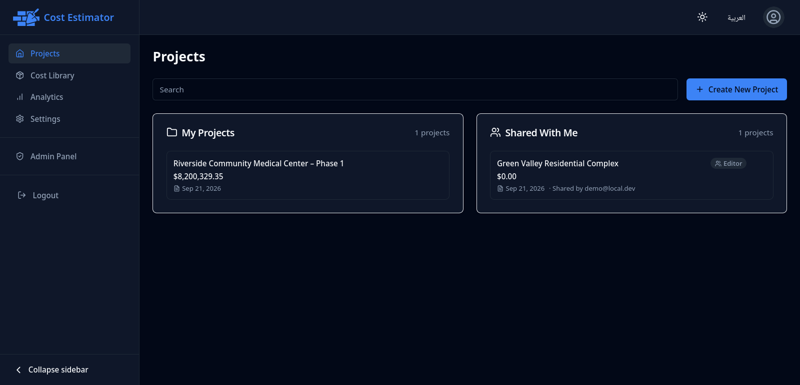
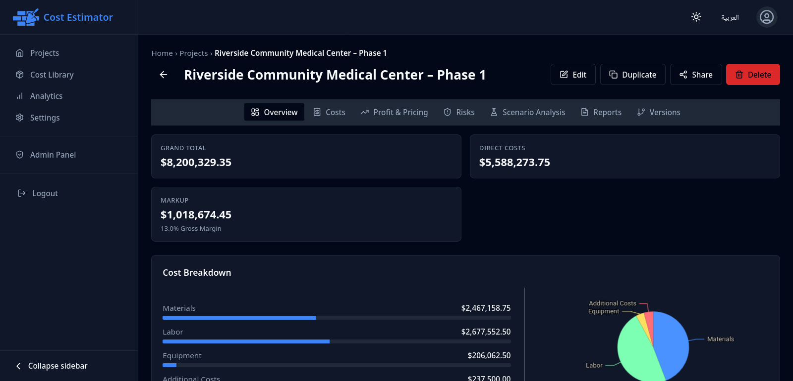
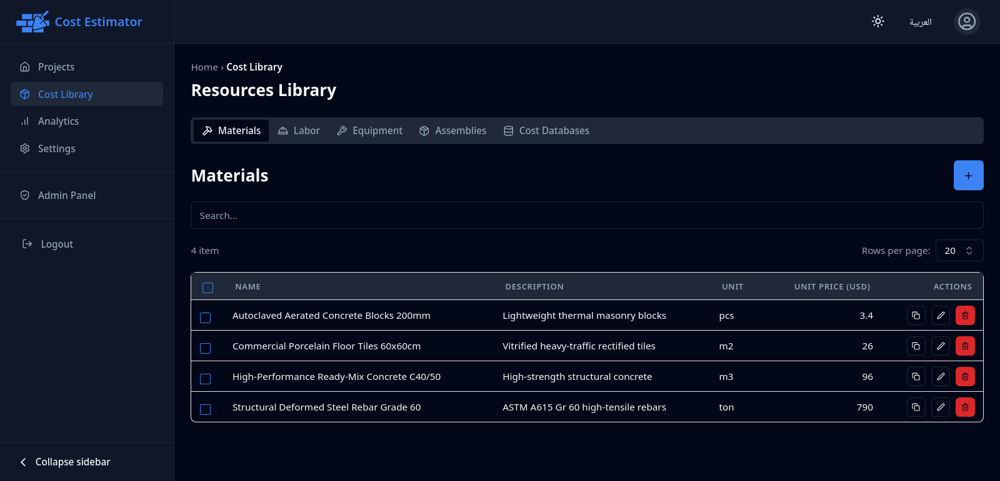
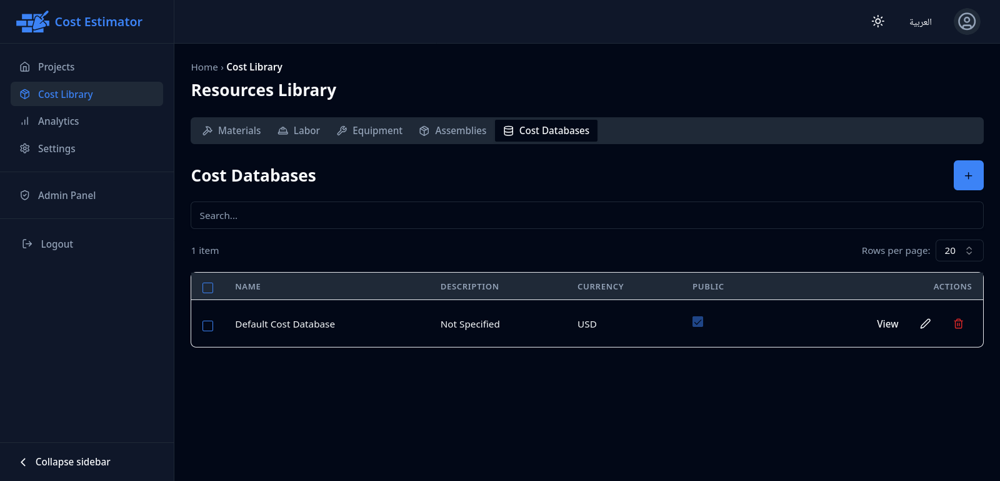
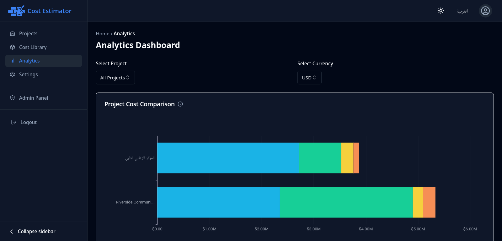

# BinaaCost

[](https://opensource.org/licenses/Apache-2.0)
[](https://vitejs.dev/)
[](https://reactjs.org/)
[](https://pocketbase.io/)
[](https://www.typescriptlang.org/)

> 🇾🇪 **متوفر باللغة العربية:** يمكنك الاطلاع على هذه الصفحة باللغة العربية [عبر هذا الرابط](README.ar.md).

An enterprise-ready web application for construction project cost estimation, budgeting, proposal generation, and financial risk modeling. Built with **React 18**, **TypeScript**, **Tailwind CSS**, and **PocketBase**, it delivers cent-exact financial calculations, bilingual (English & Arabic) RTL/LTR interfaces, offline-first PWA resilience, parametric cost libraries, and secure client sharing.

---

## Features

- **Project Management**: Create, edit, duplicate, soft-delete, and restore construction projects with location, duration, size, and WBS groupings.
- **Detailed Cost Breakdown**: Parametric estimation across five distinct cost categories:
  - **Materials**: Quantities, units, unit rates, supplier notes, and group assignment.
  - **Labor**: Trades, crew counts, daily rates, days on site, and automated total cost computation.
  - **Equipment**: Rental vs. purchase toggles, period rates, duration, fuel, and maintenance allowances.
  - **Additional Costs**: Lump-sum allowances for permits, insurance, testing, and utilities.
  - **Risk Register**: Qualitative risk assessments (Low, Medium, High) with calculated expected monetary contingency.
- **Financial Calculation Engine**: Cent-exact decimal arithmetic computing direct costs, location factor adjustments, overhead, contingency (flat, risk-based, or combined), markup, bid price, tax, and gross margin percentages.
- **Parametric Cost Library**:
  - **Cost Databases**: Master CSI MasterFormat databases with city location multipliers and bulk CSV import.
  - **Assemblies**: Pre-built composite assemblies across multiple trades with scaling factors.
  - **User Libraries**: Personal unit rate libraries for standard materials, labor, and equipment with deduplicated synchronization.
- **Scenario Simulation**: Server-side sensitivity modeling simulating inflation, labor rate changes, schedule slippage, and risk realization without altering live project data.
- **Client Proposals & Reports**:
  - Formal client proposal generator with executive summary, terms, and signature blocks.
  - Quality control warnings identifying incomplete or unpriced line items.
  - High-resolution client-side PDF export via `react-to-pdf` with automatic light-theme print styling.
- **Versioning & Audit Trail**:
  - Point-in-time project snapshots with frozen financial summaries.
  - Side-by-side version comparison with category-by-category delta calculations.
  - Three-way visual diffing and conflict resolution before version restoration.
  - Finalized version locking preventing changes or deletions to approved baselines.
- **Sharing & Collaboration**:
  - Internal team collaboration with `viewer` and `editor` project roles.
  - Secure external share links with 48-character tokens, required expiration, and optional password gates.
  - Public viewer with server-calculated totals and redacted risk registers.
- **Offline-First PWA Architecture**:
  - Installable progressive web app with service worker caching via Workbox.
  - LocalForage mutation queue with automated replay upon reconnection.
  - Idempotent insert protection via user-scoped `client_mutation_id` partial indexes.
  - Dead-letter queue and management drawer for failed mutations.
- **Administration Suite**:
  - User management (create, inspect, edit, delete, and toggle `user` vs. `super_admin` roles).
  - Global project management with ownership transfer capabilities.
  - Bilingual dropdown presets configuration for units, categories, and probabilities.
  - Full audit logging tracking changes across 22 collections.
- **Bilingual Internationalization (i18n)**:
  - Full English (LTR) and Arabic (RTL) localization.
  - Tailored Arabic typography with `Noto Sans Arabic`.
  - Automated dictionary parity regression testing.

---

## User Interface & Screenshots

### Arabic (RTL)

| Dashboard | Project Estimation |
| :---: | :---: |
|  |  |

| Resource Library | Cost Database | Analytics & Simulation |
| :---: | :---: | :---: |
|  |  |  |

### English (LTR)

| Dashboard | Project Estimation |
| :---: | :---: |
|  |  |

| Resource Library | Cost Database | Analytics & Simulation |
| :---: | :---: | :---: |
|  |  |  |

---

## Tech Stack

| Layer | Technology |
| :--- | :--- |
| **Frontend Framework** | React 18.3.1, TypeScript 5.9.3, Vite 5.4.21 |
| **Styling & Components** | Tailwind CSS 3.4.19, Radix UI primitives, Lucide React, Framer Motion |
| **State & Data Fetching** | TanStack React Query 5.90.16, React Router DOM 6.30.3 |
| **Forms & Validation** | React Hook Form 7.71.0, Zod 3.25.76 |
| **Mathematics & Precision** | Decimal.js 10.6.0 (Cent-exact half-up rounding) |
| **Internationalization** | i18next 23.16.8, react-i18next 14.1.3, @radix-ui/react-direction |
| **Data Visualization** | Apache ECharts 5.6.0, echarts-for-react 3.0.5 |
| **Offline & Storage** | LocalForage 1.10.0, vite-plugin-pwa 0.20.5, Workbox |
| **Backend & Database** | PocketBase 0.28.0 (Embedded SQLite, Goja JSVM Server Hooks) |
| **Testing** | Vitest 1.6.1, React Testing Library 16.3.3, Playwright 1.57.0 |

---

## Getting Started

### Prerequisites
- **Node.js**: `v20.x` or higher
- **pnpm**: `v9.x` or higher (`pnpm` is strictly required)
- **PocketBase**: Pre-compiled binary located at `pocketbase/pocketbase` (Linux x86_64) or downloaded from [pocketbase.io](https://pocketbase.io)

### 1. Install Dependencies
```bash
pnpm install
```

### 2. Configure Environment
Copy the example environment configuration:
```bash
cp .env.example .env
```

Ensure `.env` contains:
```bash
VITE_POCKETBASE_URL=/
```

### 3. Production Deployment (Recommended)
BinaaCost includes a fully automated production deployment via Docker Compose.
```bash
docker compose up -d --build
```
This spins up PocketBase (with your data bound to `./pb_data`) and a Caddy reverse proxy serving over HTTPS on port 443.

### 4. Start the Development Server
If you prefer running locally without Docker:

In your first terminal:
```bash
cd pocketbase
./pocketbase serve --dev
```

In your second terminal:
```bash
pnpm dev
```
The application will be accessible at **`http://127.0.0.1:8080`**.

---

## Available Commands

All scripts are executed via `pnpm`:

| Command | Description |
| :--- | :--- |
| `pnpm dev` | Starts the Vite local development server on port 8080 with HMR |
| `pnpm build` | Typechecks the project and creates an optimized production bundle in `dist/` |
| `pnpm preview` | Serves the production build locally for verification |
| `pnpm typecheck` | Runs the TypeScript compiler check across the entire codebase |
| `pnpm lint` | Runs ESLint across all files with zero-warning tolerance (`--max-warnings 0`) |
| `pnpm lint:fix` | Runs ESLint with automatic autofixing |
| `pnpm test` | Runs the Vitest test runner interactively in watch mode |
| `pnpm test run` | Runs all 64 Vitest unit and integration test files once |
| `pnpm coverage` | Runs the Vitest test suite and outputs code coverage analysis |
| `pnpm e2e` | Runs Playwright End-to-End tests against Chromium, Firefox, and WebKit |

---

## Testing

The project maintains comprehensive test coverage across unit, integration, and E2E tiers:

```bash
# Run typechecking, linting, and unit tests
pnpm typecheck && pnpm lint && pnpm test run

# Run Playwright End-to-End tests (Requires PocketBase running on :8090)
pnpm e2e
```

For detailed testing practices and test suite specifications, see [docs/testing.md](docs/testing.md).

---

## Architecture & Codebase Layout

```text
src/
├── app/                  # Application shell, layout routing, and root providers
├── features/             # Business domain feature modules
│   ├── admin/            # Platform administration, user management, audit logs
│   ├── auth/             # Authentication forms, context, role hooks
│   ├── cost-library/     # Master cost databases, assemblies, resource libraries
│   ├── projects/         # Project estimation, line items, sharing, versions, analytics
│   ├── reports/          # Report generation and PDF export utilities
│   └── settings/         # Profile management and company financial defaults
├── integrations/         # PocketBase client, repository patterns, custom JSVM routes
├── pages/                # Route components mounted by React Router
└── shared/               # Reusable primitives, design tokens, hooks, and financial logic
    ├── components/       # Common UI elements and Radix primitives (shadcn-inspired)
    ├── hooks/            # Cross-cutting React hooks (currency, dates, responsiveness)
    ├── lib/              # Infrastructure libraries (OfflineManager, formatting, math)
    └── logic/            # Pure business calculations (financials, risk, version costs)

pocketbase/
├── pb_hooks/             # 15 self-contained JSVM server hooks & custom REST endpoints
└── pb_migrations/        # 33 database migrations defining collections, rules, and indexes
```

For in-depth architectural and backend documentation, refer to:
- [System Architecture](docs/architecture.md)
- [PocketBase Backend & Hooks](docs/pocketbase.md)
- [Database Schema & Collections](docs/database.md)
- [Financial Calculation Engine](docs/financial-engine.md)
- [Offline Synchronization](docs/offline-and-sync.md)
- [Internationalization & RTL](docs/localization.md)
- [Application Features Reference](docs/features.md)
- [Developer Workflow](docs/development.md)

---

## Contributing

We welcome contributions to BinaaCost. Please review [CONTRIBUTING.md](CONTRIBUTING.md) for code style standards, migration workflows, translation requirements, and pull request guidelines.

### Local Validation and CI Parity

Before submitting a pull request, ensure your changes pass the CI validation checks. You can run these locally:

- **Full validation check**: `pnpm check` (Runs typecheck, lint, and unit tests)
- **End-to-End Tests**: Start PocketBase (`./pocketbase serve --dev`) then run `pnpm e2e`

When you submit a PR, GitHub Actions will automatically run these checks along with Playwright E2E tests and PocketBase migration verification. If CI fails, you can download the artifacts from the GitHub Actions page to inspect the logs, code coverage, or Playwright traces.

---

## Security

For vulnerability disclosure protocols and details on our implemented security controls, please review [SECURITY.md](SECURITY.md).

---

## License

This project is licensed under the terms of the [Apache License 2.0](LICENSE).
