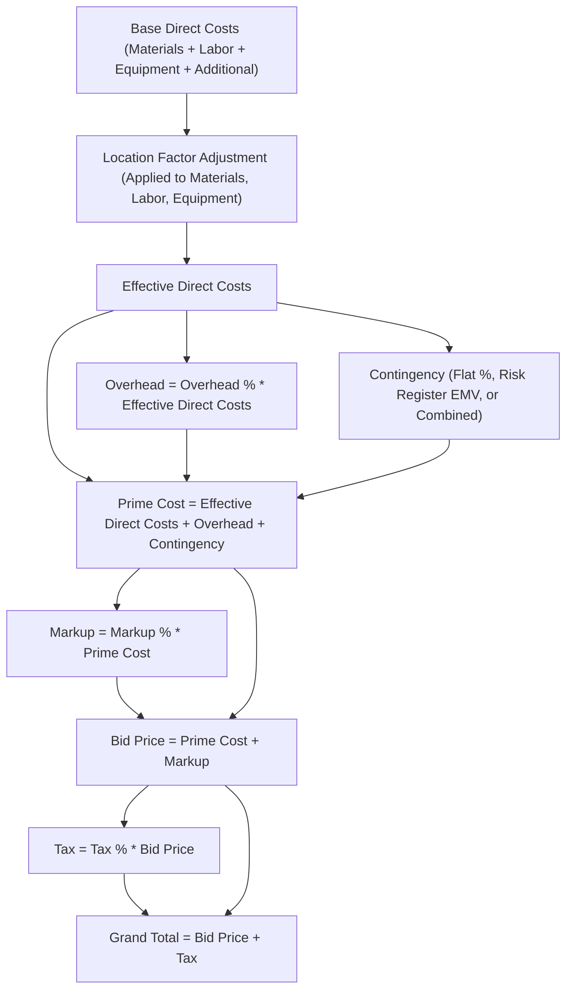
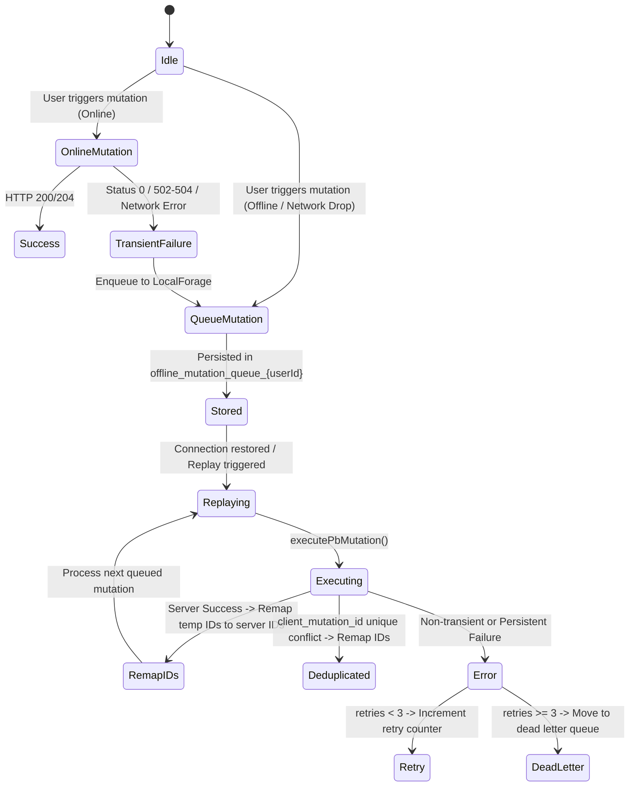
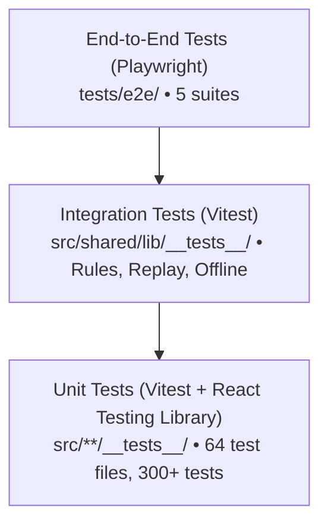

# BinaaCost Engineering Standards

> **Purpose:** Protect the architectural integrity, cent-exact financial precision, offline resilience, bilingual accessibility, and security invariants of BinaaCost.
>
> **Core principle:** **Be strict about boundaries, flexible about implementations.**

---

## 0. Engineering Principles

BinaaCost is an enterprise-grade construction cost estimation, budgeting, proposal generation, and financial risk modeling system. It operates both as an offline-first Progressive Web Application (PWA) on job sites and as a multi-user collaborative platform.

The standards exist to maintain system safety, financial precision, and codebase clarity as the product grows, not to impose unnecessary bureaucracy.

Contributors should prefer:

1. **Deterministic mathematics over floating-point approximations.**
2. **Strict boundary enforcement over ad-hoc cross-module access.**
3. **The simplest solution that satisfies the architecture.**
4. **Existing project patterns over new abstractions.**
5. **Small, local changes over wide-reaching refactors.**
6. **Automated CI validation over rules that depend on reviewer memory.**
7. **Offline durability over continuous network dependency.**

### 0.1 Normative Language

The key words in this document are intentional:

- **MUST** — Required. Violating the rule breaks a protected architectural, mathematical, security, offline, or localization invariant.
- **MUST NOT** — Strictly prohibited.
- **SHOULD** — Preferred default. A contributor may deviate only when there is a documented, sound technical justification.
- **SHOULD NOT** — Discouraged default, but permitted with clear justification.
- **MAY** — Optional.

A `SHOULD` deviation must be explained in the pull request description.
A `MUST` or `MUST NOT` deviation is an architectural change and requires review via an Architecture Decision Record (ADR).

---

# 1. System Identity & Stack

## 1.1 Technology Stack

BinaaCost is built upon the following core technologies:

| Layer | Technology | Version / Specification | Architectural Role |
| :--- | :--- | :--- | :--- |
| **Frontend Framework** | React | `18.3.1` | Single-Page Application (SPA) with declarative UI |
| **Language & Typing** | TypeScript | `5.9.3` | Strict type safety across components, hooks, and logic |
| **Build Tool & Bundler** | Vite | `5.4.21` | Rapid HMR, code-splitting, and asset bundling |
| **Styling & Design System** | Tailwind CSS & Radix UI | Tailwind `3.4.19`, Radix primitives | Design tokens, accessible UI components, logical RTL layout |
| **Server State & Caching** | TanStack React Query | `5.90.16` | Asynchronous query caching, optimistic mutations, refetch policies |
| **Routing & Navigation** | React Router DOM | `6.30.3` | Client routing, route-level layouts, and authentication guards |
| **Form Management** | React Hook Form & Zod | RHF `7.71.0`, Zod `3.25.76` | Controlled form state with schema-driven input validation |
| **Financial Engine** | Decimal.js | `10.6.0` | Cent-exact, half-up rounding arbitrary-precision arithmetic |
| **Localization (i18n)** | i18next & react-i18next | i18next `23.16.8`, react-i18next `14.1.3` | Bilingual LTR/RTL support (English and Arabic) across 24 namespaces |
| **Data Visualization** | Apache ECharts | `5.6.0` (via `echarts-for-react 3.0.5`) | RTL-aware financial charts, breakdown charts, and scenario curves |
| **Offline Persistence** | LocalForage & Workbox | LocalForage `1.10.0`, `vite-plugin-pwa 0.20.5` | Client-side IndexedDB mutation queues and Service Worker asset caching |
| **Backend & Database** | PocketBase | `0.28.0` | Embedded SQLite database, Goja JSVM server hooks, and REST/Realtime APIs |
| **Testing Frameworks** | Vitest & Playwright | Vitest `1.6.1`, Playwright `1.57.0` | Unit/integration testing (jsdom) and multi-browser E2E testing |
| **Package Management** | pnpm | `>= 9.x` (strictly enforced) | Fast, deterministic, hard-linked dependency resolution |

Technology versions MAY be updated as part of maintenance; however, the architectural contracts established in this document supersede individual library versions.

## 1.2 Enterprise Domain Mission

BinaaCost guarantees:
- **Cent-exact financial computation** with zero floating-point accumulation drift.
- **Uninterrupted field operation** during network dropouts with automatic queued replay.
- **First-class bilingual parity** in both English (LTR) and Arabic (RTL).
- **Auditability and immutability** for approved project version baselines and system configurations.

---

# 2. Non-Negotiable Architectural Boundaries

The following boundaries are protected invariants. Code violating these rules MUST NOT be merged.

## 2.1 The "No Floating-Point" Financial Boundary

Floating-point drift in construction bids leads to legal disputes, incorrect margins, and contract discrepancies.

1. **Storage Invariant:** All monetary amounts MUST be stored in the database as **integer cents** (e.g., `$12.50` is stored as `1250`).
2. **Client Math Invariant:** Client-side financial calculations MUST use `Decimal.js` (via `@/shared/lib/math`) configured with half-up rounding (`.toDecimalPlaces(2)`). Native JavaScript floating-point arithmetic (`+`, `-`, `*`, `/`) MUST NOT be used for monetary math.
3. **Server Math Invariant:** PocketBase JSVM hooks MUST execute monetary calculations using integer-cents arithmetic with half-up rounding (`Math.round((n + Number.EPSILON) * 100) / 100` or equivalent integer math).
4. **Reconciliation Invariant:** Every step in the financial cascade (`effective direct costs + overhead + contingency + markup + tax = grand total`) MUST reconcile exactly without a single cent discrepancy.

## 2.2 Client / Backend Boundary

1. The frontend MUST communicate with the backend exclusively through the PocketBase SDK (`@/integrations/pocketbase/client`) and custom JSVM endpoints.
2. Direct database access or bypasses of PocketBase collection rules are prohibited.
3. Mutations MUST pass Optimistic Concurrency Control (OCC) `updated` timestamps to prevent silent overwrites.

## 2.3 Domain & Feature Boundary

1. Features MUST live in self-contained directories under `src/features/<feature>/`.
2. Features MUST NOT import private internal modules from other features. Cross-feature communication MUST pass through the providing feature's public barrel (`index.ts`).
3. Sub-features (e.g., `project-costs`, `project-versions`, `project-analytics`) belong inside their parent domain (`src/features/projects/`).

## 2.4 Shared Code Promotion Rule

1. Code belongs inside its owning feature by default.
2. Code MUST NOT be moved to `src/shared/` unless it is required by **three (3) or more distinct features**.
3. Types MUST be co-located with their owning feature or shared module. Creating generic global type dumps (such as a global `types.ts` at the root of `src/`) is prohibited.

## 2.5 Offline & Idempotency Boundary

1. All project editing mutations MUST support offline execution or transient error recovery via `useOfflinePb` and `OfflineManager`.
2. Every client insert MUST attach a unique client-generated UUID (`client_mutation_id`). The server MUST enforce partial unique indexing on `(user_id, client_mutation_id)`.
3. Optimistic IDs (`temp_*`) MUST be tracked and remapped upon server synchronization before dependent records are processed.

## 2.6 Security & Permission Boundary

1. **Financial Settings Authorization:** Project collaborators with `editor` or `viewer` roles MUST NOT modify `financial_settings` or `financial_settings_confirmed`. Only the project `owner` or a `super_admin` can edit financial loading parameters (`editor_permissions.pb.js`).
2. **Finalized Version Immutability:** Version snapshots marked `is_final: true` MUST NOT be updated or deleted under any circumstances (`project_versions.pb.js`).
3. **External Share Security:** Share links MUST use cryptographically secure 48-character tokens hashed with SHA-256 in the database. Risk registers MUST be redacted on public shares (`public_share.pb.js`).
4. **Administrator Safety Invariants:** The system MUST prevent an administrator from deleting their own account or deleting/demoting the last remaining `super_admin` (`admin_users.pb.js`).

---

# 3. Repository Architecture

The repository is structured into the following operational tiers:

```text
BinaaCost/
├── src/
│   ├── app/                  # Application shell, layout, global providers, and router
│   │   ├── layout/           # LayoutShell, Sidebar, Topbar, Breadcrumbs
│   │   ├── providers/        # AuthProvider, ThemeProvider, LanguageProvider
│   │   └── router/           # ProtectedRoute, AdminRoute, route declarations
│   ├── features/             # Domain feature modules
│   │   ├── admin/            # User administration, global settings, audit logs
│   │   ├── analytics/        # Cross-project portfolio metrics and visualizations
│   │   ├── auth/             # Login, auth context, role hooks, auth schemas
│   │   ├── cost-library/     # Master cost databases, CSI divisions, assemblies, user resources
│   │   ├── projects/         # Project estimation engine and lifecycle management
│   │   │   ├── project-core/       # Project CRUD, overview dashboard, item comments, WBS groups
│   │   │   ├── project-costs/      # Line items: Materials, Labor, Equipment, Additional, Risks
│   │   │   ├── project-analytics/  # Scenario simulation, sensitivity modeling
│   │   │   ├── project-reports/    # Proposal generator, QC checks, PDF formatting
│   │   │   ├── project-sharing/    # Team collaborator permissions, external share links
│   │   │   └── project-versions/   # Version snapshots, visual diffs, conflict resolution, restore
│   │   ├── reports/          # Cross-project reporting utilities and PDF export hooks
│   │   └── settings/         # User profile, company financial defaults, credentials
│   ├── integrations/         # External integrations and backend SDK wrappers
│   │   └── pocketbase/       # PocketBase client instance, executor, repositories, hooks
│   ├── pages/                # Route-level view orchestrators mounted by React Router
│   ├── shared/               # Reusable primitives and pure business logic (used across 3+ features)
│   │   ├── components/       # Common UI elements (Modals, Headers, Tables, Sync indicators)
│   │   │   └── ui/           # Radix UI + Tailwind design system primitives (shadcn-inspired)
│   │   ├── hooks/            # Cross-cutting hooks (currency, dates, responsiveness)
│   │   ├── lib/              # Infrastructure utilities (math, offline, queryDefaults, sanitize)
│   │   └── logic/            # Pure business logic (financial calculations, risk formulas, diffing)
│   ├── globals.css           # Tailwind base styles, theme tokens, WCAG compliance rules
│   ├── i18n.ts               # i18next runtime initialization and namespace registry
│   └── main.tsx              # Application bootstrap, root providers, error boundary
├── pocketbase/
│   ├── pb_hooks/             # 22 self-contained Goja JSVM server hooks & custom endpoints
│   ├── pb_migrations/        # Database schema migrations, collections, rules, and indexes
│   └── pb_data/              # Local SQLite database files (gitignored)
├── public/
│   ├── locales/              # Translation dictionaries: 24 namespaces in en/ and ar/
│   └── offline.html          # Fallback page served by Service Worker when offline
├── tests/
│   └── e2e/                  # Playwright End-to-End test suites and setup harnesses
├── docs/                     # Technical architecture, database, and developer documentation
└── package.json              # Project scripts, dependencies, and resolutions
```

---

# 4. Frontend Architecture & Modular Boundaries

## 4.1 Feature Directory Shape

Each feature under `src/features/<feature>/` SHOULD adhere to this standard organization:

```text
features/<feature-name>/
├── components/       # Feature-specific UI components
├── hooks/            # Feature-specific React hooks (TanStack Query hooks, state)
├── types/            # Feature-specific TypeScript interfaces and Zod schemas
├── utils/            # Feature-specific pure helper functions (optional)
└── index.ts          # Public API export barrel
```

Do not create empty subdirectories. Only introduce folders when meaningful code exists.

## 4.2 Feature Public API Barrel

1. Every feature MUST expose its public components, hooks, and types via `index.ts`.
2. External consumers (other features or route pages) MUST import from the feature root:
   ```typescript
   // ✅ GOOD: Importing from public barrel
   import { ProjectCard, useProjects } from "@/features/projects/project-core";

   // ❌ BAD: Reaching into internal modules
   import { ProjectCard } from "@/features/projects/project-core/components/ProjectCard";
   ```

## 4.3 Route Pages as Thin Orchestrators

Pages inside `src/pages/` MUST serve as thin composition containers:
- Route pages configure layout parameters, page headers, breadcrumbs, and document titles.
- Route pages mount feature components; they MUST NOT contain inline business calculations, large SQL/PB calls, or dense form definitions.

## 4.4 Shared UI Component Principles

Primitives under `src/shared/components/ui/` (buttons, dialogs, dropdowns, inputs, tables, badges) are design system primitives:
1. They MUST be implementation-agnostic and free of project business logic.
2. They MUST support accessibility props (ARIA attributes, keyboard navigation).
3. They MUST support logical styling (e.g., using `cn()` with Tailwind logical classes).
4. Shared UI MUST NOT quietly become an alternate feature layer.

---

# 5. Financial Calculation Engine & Money Math

The financial engine is the mathematical core of BinaaCost. Inaccuracies compromise the system.

## 5.1 Storage Architecture: Integer Cents

1. All database columns representing currency (`unit_price`, `daily_rate`, `cost_per_period`, `maintenance_cost`, `fuel_cost`, `amount`, `impact_amount`, `contingency_amount`) MUST store integer cents.
2. Zero or negative monetary amounts: unit costs, quantities, and durations MUST enforce `min: 0`.

## 5.2 Client Arithmetic with `Decimal.js`

1. Pure mathematical helpers live in [src/shared/lib/math.ts](file:///home/user/Apps/0Dev/BinaaCost/src/shared/lib/math.ts).
2. All calculations MUST use arbitrary-precision decimals:
   ```typescript
   import { Decimal, round, safeAdd, safeMult } from "@/shared/lib/math";

   // ✅ GOOD: Cent-exact decimal arithmetic
   const total = round(new Decimal(quantity).times(unitPriceCents), 0);

   // ❌ BAD: Native floating-point multiplication
   const badTotal = quantity * unitPriceCents;
   ```
3. Currency display formatting MUST divide integer cents by 100 and format via `Intl.NumberFormat` ([src/shared/lib/formatCurrency.ts](file:///home/user/Apps/0Dev/BinaaCost/src/shared/lib/formatCurrency.ts)).

## 5.3 Server Arithmetic in Goja JSVM

1. Server hooks MUST compute totals using integer cents and half-up rounding.
2. Never store unrounded floating-point calculations into database columns.

## 5.4 Category Direct Cost Formulas

Cost items are computed prior to applying project loadings ([src/shared/logic/shared.ts](file:///home/user/Apps/0Dev/BinaaCost/src/shared/logic/shared.ts)):

1. **Materials Total:**
   $$\text{Total} = \sum (\text{quantity} \times \text{unit\_price})$$
2. **Labor Total:**
   $$\text{Total} = \sum (\text{number\_of\_workers} \times \text{daily\_rate} \times \text{total\_days})$$
3. **Equipment Total:**
   - Rental: $\text{Cost} = (\text{quantity} \times \text{cost\_per\_period} \times \text{usage\_duration}) + \text{maintenance\_cost} + \text{fuel\_cost}$
   - Purchase: $\text{Cost} = (\text{quantity} \times \text{cost\_per\_period} \times 1) + \text{maintenance\_cost} + \text{fuel\_cost}$
4. **Additional Costs Total:**
   $$\text{Total} = \sum \text{amount}$$
5. **Risk Register Contingency (Expected Monetary Value - EMV):**
   $$\text{EMV} = \sum \left(\text{impact\_amount} \times \frac{\text{probability\_percent}}{100}\right)$$

## 5.5 Financial Cascade & Loading Formulas

Project financial summaries are evaluated in [src/shared/logic/financials.ts](file:///home/user/Apps/0Dev/BinaaCost/src/shared/logic/financials.ts):



### Loading Rules:
- **Location Factor:** Applied to physical trades (Materials, Labor, Equipment). It MUST NOT be applied to Additional Costs (which represent fixed contractual lump sums).
- **Contingency Basis:**
  - `flat`: $\text{Effective Direct Costs} \times \frac{\text{contingency\_percent}}{100}$
  - `risk_register`: Expected Monetary Value calculated from active risks.
  - `combined`: $\text{Flat Contingency} + \text{Risk Register EMV}$.
- **Prime Cost:** $\text{Effective Direct Costs} + \text{Overhead} + \text{Contingency}$.
- **Markup:** Calculated as a percentage of **Prime Cost** (not direct costs).
- **Bid Price:** $\text{Prime Cost} + \text{Markup}$.
- **Tax:** Calculated as a percentage of **Bid Price**.
- **Grand Total:** $\text{Bid Price} + \text{Tax}$.

## 5.6 Decoupled Calculation Inputs vs Persisted Schemas

1. Pure calculation functions MUST accept `FinancialSettings` ([src/shared/logic/financials.ts](file:///home/user/Apps/0Dev/BinaaCost/src/shared/logic/financials.ts)), where defaults are supplied for optional fields.
2. The database persistence model MUST use `ProjectFinancialSettings` ([src/features/projects/project-core/types/project.ts](file:///home/user/Apps/0Dev/BinaaCost/src/features/projects/project-core/types/project.ts)), where all persisted fields are required.
3. Keep calculation inputs decoupled from database record shapes so persistence schemas can evolve without breaking core math logic.

---

# 6. Offline-First PWA Architecture & Synchronization

BinaaCost operates on construction sites with intermittent or absent network connectivity.

## 6.1 Progressive Web App (PWA) Layer

1. Service worker generation is handled via `vite-plugin-pwa` with Workbox precaching.
2. Static assets (HTML, CSS, JS, fonts, images) MUST be precached.
3. When offline navigation fails, the Service Worker MUST serve `/offline.html`.

## 6.2 Mutation Queue Lifecycle

Offline operations are managed by [src/shared/lib/offline.ts](file:///home/user/Apps/0Dev/BinaaCost/src/shared/lib/offline.ts) and executed via [src/integrations/pocketbase/executor.ts](file:///home/user/Apps/0Dev/BinaaCost/src/integrations/pocketbase/executor.ts):



## 6.3 Transient Error Detection

The client MUST distinguish between transient network errors and permanent server rejections:
- **Transient (Queueable):** HTTP status `0`, `502`, `503`, `504`, `ECONNREFUSED`, `ETIMEDOUT`, `Failed to fetch`.
- **Permanent (Non-Queueable):** HTTP `400` (Validation error), `401` (Unauthorized), `403` (Forbidden). Permanent errors MUST NOT be queued; they must notify the user immediately.

## 6.4 Idempotency via `client_mutation_id`

1. Every `INSERT` mutation MUST include a UUID `client_mutation_id`.
2. The database maintains a unique partial index on `(user_id, client_mutation_id)`:
   ```sql
   CREATE UNIQUE INDEX idx_{table}_user_cmid ON {table} (user_id, client_mutation_id)
   WHERE client_mutation_id IS NOT NULL AND client_mutation_id != '';
   ```
3. If an insert mutation is retried after a network failure, the unique constraint ensures the record is not duplicated. The replay engine treats constraint hits as successful deduplicated inserts and retrieves the existing record ID.

## 6.5 Optimistic IDs & ID Remapping

1. Records created offline receive temporary IDs prefixed with `temp_` (e.g., `temp_mat_123`).
2. When the server assigns a permanent ID, `OfflineManager` MUST recursively remap all pending payloads, foreign keys, and TanStack Query caches matching the temporary ID ([src/shared/lib/offline.ts](file:///home/user/Apps/0Dev/BinaaCost/src/shared/lib/offline.ts#L48-L90)).

## 6.6 Optimistic Concurrency Control (OCC)

1. Updates MUST pass the record's current `updated` timestamp.
2. The backend hook [project_concurrency.pb.js](file:///home/user/Apps/0Dev/BinaaCost/pocketbase/pb_hooks/project_concurrency.pb.js) compares incoming and stored timestamps across 10 core collections.
3. Conflicting stale updates MUST be rejected with HTTP `409 Conflict`.

## 6.7 Dead-Letter Queue Isolation

1. Mutations failing after `MAX_RETRIES = 3` MUST be moved to `offline_dead_letter_queue_${userId}`.
2. The user MUST be notified through [OfflineSyncIndicator.tsx](file:///home/user/Apps/0Dev/BinaaCost/src/shared/components/OfflineSyncIndicator.tsx) to inspect or discard failed mutations.

---

# 7. State Management & Data Fetching

## 7.1 Server State with TanStack React Query

1. Server data MUST be managed through TanStack React Query.
2. Components MUST NOT copy query data into local React `useState` unless creating an isolated draft form.

## 7.2 Stale Time Policies

Cache policies are standardized in [src/shared/lib/queryDefaults.ts](file:///home/user/Apps/0Dev/BinaaCost/src/shared/lib/queryDefaults.ts):
- `STATIC` (`15 minutes`): Dropdown options, currency exchange rates, platform configuration.
- `DYNAMIC` (`0 seconds`): Project line items, cost totals, comment threads. Refetched on mount.
- **Window Focus Refetching:** MUST be disabled (`refetchOnWindowFocus: false`) for active project cost tables to prevent overwriting in-progress user table edits.

## 7.3 Optimistic Updates Pattern

Mutations modifying project items SHOULD follow the standard optimistic update pattern:
1. `onMutate`: Cancel outgoing queries, snapshot previous cache, and optimistically inject the item.
2. `onError`: Roll back the cache to the snapshot and display an error toast.
3. `onSettled`: Invalidate affected query keys to reconcile with authoritative server state.

## 7.4 PocketBase Client Configuration

The PocketBase SDK instance in [src/integrations/pocketbase/client.ts](file:///home/user/Apps/0Dev/BinaaCost/src/integrations/pocketbase/client.ts) enforces two mandatory runtime behaviors:
1. **Auto-Cancellation Disabled:** `pb.autoCancellation(false)` MUST be preserved. PocketBase SDK auto-cancels parallel requests to the same collection path by default; React Query already manages request lifecycles.
2. **Precise Session Healing:** `pb.afterSend` intercepts HTTP `401` or `404` for the authenticated user's own record to clear stale auth tokens. Transient 404s on other entities MUST NOT log the user out.

---

# 8. Forms & Validation Boundaries

## 8.1 Schema-Driven Validation with Zod

1. All user forms MUST use React Hook Form paired with Zod schemas via `@hookform/resolvers/zod`.
2. Schemas MUST validate constraints before data reaches repository or network layers.

## 8.2 Currency Boundary Conversion Pattern

1. **Inbound (DB -> Form):** Initialize form values by dividing stored integer cents by 100 to present natural decimal currency to the user.
2. **Outbound (Form -> DB):** Form schemas MUST convert user decimal inputs back to integer cents using `Math.round(val * 100)`:
   ```typescript
   export const materialFormSchema = z.object({
     name: z.string().min(1, "Name is required"),
     quantity: z.number().min(0, "Quantity must be positive"),
     unit_price: z.number().min(0).transform((val) => Math.round(val * 100)),
   });
   ```

---

# 9. PocketBase Backend & Server Architecture

## 9.1 Goja JSVM Server Hooks (`pocketbase/pb_hooks/`)

Server extensions run within PocketBase's embedded Goja JavaScript runtime.

1. **Closure Isolation Constraint:** Due to Goja runtime variable scoping constraints across HTTP requests, helper functions MUST be declared inside the handler function body or kept strictly self-contained within each `.pb.js` file.
2. **Transactions:** Operations modifying multiple records or tables atomically (e.g., currency conversion, snapshot restoration, share cleanup) MUST run within `$app.runInTransaction((txApp) => { ... })`.
3. **In-Memory Rate Limiting:** Security counters (such as public share password attempts) MUST use `$app.store()` to avoid unindexed database churn.

## 9.2 Database Migrations (`pocketbase/pb_migrations/`)

1. **Reversibility:** Every migration file MUST provide both up and down execution blocks:
   ```javascript
   migrate((app) => {
     // Apply changes
   }, (app) => {
     // Revert changes
   });
   ```
2. **Idempotency:** Migrations MUST verify table and column existence before creating or modifying schema elements.
3. **Foreign Key Safety:** Foreign key relations referencing the `users` collection MUST set `cascadeDelete: false` to prevent accidental deletion of user projects when an account is managed.
4. **Numeric Safety:** All rate, duration, and monetary fields in collection definitions MUST enforce `min: 0`.

---

# 10. Security, Authorization & Privacy

## 10.1 Role Hierarchy

BinaaCost implements two user roles:
- `user`: Standard estimator and project collaborator.
- `super_admin`: Full platform control, user management, audit logs, and global settings.

## 10.2 Project Permission Matrix

| Operation | Project Owner | Project Editor | Project Viewer | Super Admin |
| :--- | :---: | :---: | :---: | :---: |
| View Project & Line Items | ✅ | ✅ | ✅ | ✅ |
| Add / Edit / Delete Line Items | ✅ | ✅ | ❌ | ✅ |
| Edit Financial Settings | ✅ | ❌ | ❌ | ✅ |
| Confirm Financial Settings | ✅ | ❌ | ❌ | ✅ |
| Create / Finalize Version Snapshots | ✅ | ✅ | ❌ | ✅ |
| Restore Version Snapshots | ✅ | ❌ | ❌ | ✅ |
| Generate External Share Links | ✅ | ✅ | ❌ | ✅ |
| Delete Project | ✅ | ❌ | ❌ | ✅ |

The financial settings restriction is strictly enforced server-side by [editor_permissions.pb.js](file:///home/user/Apps/0Dev/BinaaCost/pocketbase/pb_hooks/editor_permissions.pb.js).

## 10.3 Version Immutability

Snapshots with `is_final: true` represent legally binding baselines. The server hook [project_versions.pb.js](file:///home/user/Apps/0Dev/BinaaCost/pocketbase/pb_hooks/project_versions.pb.js) intercepts and rejects all update and delete requests for finalized versions.

## 10.4 Public Share Protection

1. Tokens MUST be 48-character cryptographically random strings.
2. Tokens MUST be stored in the database as SHA-256 hashes (`token_hash`).
3. Password gates MUST hash passwords with PB's secure hasher and enforce rate limiting (maximum 20 failed attempts per 10 minutes per IP).
4. Public share payloads MUST redact raw risk registers, internal comments, and cost library metadata while serving calculated summary totals.

## 10.5 Input Sanitization & Content Security

1. User-supplied HTML or rich text MUST pass through `dompurify` ([src/shared/lib/sanitizeText.ts](file:///home/user/Apps/0Dev/BinaaCost/src/shared/lib/sanitizeText.ts)) prior to rendering.
2. Passwords, hashes, and internal authorization tokens MUST be stripped from API responses and audit log diffs.

---

# 11. Internationalization (i18n) & RTL Layouts

BinaaCost provides full, first-class parity for English (LTR) and Arabic (RTL).

## 11.1 Localization Namespaces

Translations are divided into 24 distinct domain namespaces under `public/locales/{en,ar}/`:

```text
public/locales/
├── en/               # English translations (source of truth)
└── ar/               # Arabic translations (mirrored 1:1)
```

## 11.2 No Hardcoded Strings

1. All user-visible text MUST use the translation hook: `const { t } = useTranslation("namespace")`.
2. Hardcoded English or Arabic strings in JSX components are strictly prohibited.

## 11.3 Direction-Agnostic Logical CSS

To support seamless bidirectional rendering, contributors MUST use CSS logical properties:

| Do NOT Use (Physical) | MUST Use (Logical) |
| :--- | :--- |
| `ml-*`, `mr-*` | `ms-*` (inline-start), `me-*` (inline-end) |
| `pl-*`, `pr-*` | `ps-*` (padding-start), `pe-*` (padding-end) |
| `left-*`, `right-*` | `start-*`, `end-*` |
| `text-left`, `text-right` | `text-start`, `text-end` |
| `border-l-*`, `border-r-*` | `border-s-*`, `border-e-*` |
| `rounded-l-*`, `rounded-r-*` | `rounded-s-*`, `rounded-e-*` |

Physical directional classes are allowed only for fixed visual elements that do not flip with language (e.g., media player controls).

## 11.4 Synchronous Direction Setting

[src/app/providers/LanguageProvider.tsx](file:///home/user/Apps/0Dev/BinaaCost/src/app/providers/LanguageProvider.tsx) sets `document.documentElement.dir` synchronously during rendering to prevent an LTR layout flash when loading Arabic.

## 11.5 Chart RTL Adaptations

Apache ECharts instances MUST invert horizontal axes, tooltips, and legend alignments when rendering in RTL mode ([src/shared/logic/chartPalette.ts](file:///home/user/Apps/0Dev/BinaaCost/src/shared/logic/chartPalette.ts)).

## 11.6 Translation Parity Testing

The automated test suite includes [src/shared/lib/__tests__/locale-parity.test.ts](file:///home/user/Apps/0Dev/BinaaCost/src/shared/lib/__tests__/locale-parity.test.ts). Every translation key added to `en/*.json` MUST have an equivalent key in `ar/*.json`. CI MUST fail on missing keys.

---

# 12. Accessibility (a11y) & Mobile Experience

## 12.1 WCAG 2.1 AA Compliance

1. Text and interactive components MUST satisfy WCAG 2.1 AA contrast requirements (minimum 4.5:1 for normal text, 3:1 for large text).
2. All interactive elements MUST exhibit visible focus rings using design system tokens (`focus-visible:ring-2 focus-visible:ring-ring`).

## 12.2 Semantic & Accessible Primitives

1. Interactive controls MUST use native `<button>`, `<a>`, `<input>` elements or Radix UI accessible wrappers.
2. Icons used as standalone buttons MUST include accessible `aria-label` attributes.

## 12.3 Responsive & Mobile Adaptation

BinaaCost is used in field trailers and on mobile phones:
1. Screen widths below `768px` MUST be detected via [src/shared/hooks/useMobile.ts](file:///home/user/Apps/0Dev/BinaaCost/src/shared/hooks/useMobile.ts).
2. Dense desktop cost tables MUST transform into touch-friendly card layouts on mobile viewports.
3. Wide horizontal tab navigation bars MUST convert into select dropdowns on mobile screens to prevent layout overflow.

---

# 13. Observability & Audit Logging

## 13.1 Data-Driven Audit Logs

1. The server hook [audit_log.pb.js](file:///home/user/Apps/0Dev/BinaaCost/pocketbase/pb_hooks/audit_log.pb.js) records mutations across 22 collections.
2. Audit records capture:
   ```json
   {
     "user_id": "...",
     "action": "create | update | delete",
     "collection_name": "...",
     "record_id": "...",
     "changes": { "field": { "old": "...", "new": "..." } },
     "created": "timestamp"
   }
   ```

## 13.2 Credential Protection

Sensitive fields (`password`, `passwordConfirm`, `token`, `token_hash`, `salt`) MUST be stripped before audit diffs are stored.

## 13.3 Diagnostic Integrity

1. Raw SQLite syntax errors, database file paths, or internal server stack traces MUST NOT be returned to the client.
2. User-facing error messages MUST be sanitized and localized through `errors.json`.

---

# 14. Performance & Resource Budgets

## 14.1 Code-Splitting & Dynamic Imports

1. Heavy modules (Apache ECharts, `react-to-pdf`, PapaParse) MUST be loaded lazily via dynamic imports (`React.lazy()` or `import()`) to keep initial bundle sizes lean.
2. Route components under `src/pages/` MUST be loaded asynchronously.

## 14.2 High-Throughput Bulk Operations

Bulk operations (such as CSV database imports via [import_db_items.pb.js](file:///home/user/Apps/0Dev/BinaaCost/pocketbase/pb_hooks/import_db_items.pb.js)) MUST be batched in chunks of up to 5,000 items with explicit database indexing.

---

# 15. Testing Strategy & Quality Assurance

Quality is verified across three testing tiers:



## 15.1 Testing Rules

1. **Deterministic Currency Assertions:** Tests asserting monetary values MUST assert exact decimal strings or numbers (e.g., `expect(summary.grandTotal).toBe(125050)`). Approximate or float-based assertions (`toBeCloseTo`) are prohibited for financial calculations.
2. **No Mocking of Pure Domain Logic:** Core financial algorithms ([src/shared/logic/financials.ts](file:///home/user/Apps/0Dev/BinaaCost/src/shared/logic/financials.ts), [math.ts](file:///home/user/Apps/0Dev/BinaaCost/src/shared/lib/math.ts)) MUST NEVER be mocked; they must be tested with real inputs.
3. **Accessible Selectors:** Component tests MUST query elements using accessible roles and labels (`getByRole`, `getByLabelText`, `getByText`) rather than CSS selectors or test IDs.
4. **Automated Consistency Tests:** CI executes [documentation-consistency.test.ts](file:///home/user/Apps/0Dev/BinaaCost/src/shared/lib/__tests__/documentation-consistency.test.ts) to verify that all documented scripts, environment variables, and markdown links exist and resolve.

---

# 16. Tooling, CI & Automated Enforcement

## 16.1 Package Manager: Strictly `pnpm`

1. Contributors MUST use `pnpm` (`v9.x` or higher).
2. Committing `package-lock.json` or `yarn.lock` is prohibited.
3. CI runs with `--frozen-lockfile`.

## 16.2 Zero-Warning Linting Policy

1. ESLint (`eslint.config.js`) runs with `--max-warnings 0`.
2. Unused imports are automatically flagged as errors (`unused-imports/no-unused-imports: "error"`).

## 16.3 CI Pipeline Checks

GitHub Actions (`.github/workflows/ci.yml` and `e2e.yml`) enforce:
- Typecheck: `pnpm typecheck` (`tsc -b`).
- Lint: `pnpm lint`.
- Database Migrations: `./pocketbase migrate up`.
- Unit & Integration Tests: `pnpm coverage`.
- Frontend Build: `pnpm build`.
- End-to-End Tests: `pnpm e2e` (Playwright against fresh PocketBase instance).

---

# 17. Architecture Drift Prevention

The repository enforces architectural invariants automatically:
1. `documentation-consistency.test.ts` validates that documented scripts match `package.json`, environment variables match `.env.example`, and relative markdown links exist.
2. `locale-parity.test.ts` validates 100% key parity between English and Arabic dictionaries.
3. `integration-rules.test.ts` verifies PocketBase collection security access rules.

---

# 18. Documentation & Architectural Decisions

## 18.1 Truth in Code

1. Documentation MUST reflect the working implementation. Speculative or planned features MUST NOT be documented as functional.
2. Any pull request that modifies calculation formulas, API routes, or environment configurations MUST update the corresponding documentation under `docs/`.

## 18.2 Change Tiers

### Tier 1 — Local
- Examples: Bug fixes, UI polish, localized components, test additions, documentation improvements.
- Process: Standard code review, CI green.

### Tier 2 — Contract & Schema
- Examples: Database migrations, PocketBase hook updates, financial formula changes, permission rule adjustments, new i18n namespaces.
- Process: Focused review, migration verification, updated tests.

### Tier 3 — Architectural
- Examples: Changing the offline synchronization engine, altering currency storage architecture, modifying authentication providers, introducing top-level structural packages.
- Process: Requires an Architecture Decision Record (ADR) prior to implementation.

### 18.3 ADR Format

```text
# ADR-<Number>: <Title>

## Context
What problem are we solving? What are the architectural drivers?

## Decision
What is the proposed change and boundary impact?

## Alternatives Considered
What other options were evaluated and why were they rejected?

## Consequences
Positive, negative, and neutral trade-offs.

## Migration & Rollback
How is the change safely rolled out and reverted if necessary?
```

---

# 19. Dependencies & Abstractions

## 19.1 Dependency Policy

Before adding a new dependency, contributors MUST verify:
- Can this be solved with existing project libraries (Radix UI, Tailwind, Decimal.js, TanStack Query)?
- Does the dependency support offline execution (zero runtime external CDN/cloud calls)?
- Is the package actively maintained with compatible licensing (Apache-2.0, MIT, BSD)?
- What is the impact on bundle size?

## 19.2 Premature Abstractions

- Prefer duplication over a premature or misleading abstraction.
- Only extract shared utilities when the pattern is proven across **three (3) or more distinct features**.

---

# 20. Contributor Freedom

These standards exist to protect system boundaries, not to stifle legitimate engineering choices.

1. **Implementation Freedom:** Inside an approved feature boundary, contributors have full freedom to structure internal components and private hooks.
2. **Existing Patterns First:** Contributors SHOULD inspect existing features (such as `project-costs` or `cost-library`) for proven patterns before inventing new conventions.
3. **Explicit Exceptions:** If a standard prevents a necessary technical solution or harms performance, propose an explicit exception in the PR with documented rationale.

---

# 21. Definition of Done

A task or pull request is complete when:
- [ ] Build succeeds: `pnpm build` creates production bundles without errors.
- [ ] Type check passes: `pnpm typecheck` (`tsc -b`) reports zero errors.
- [ ] Lint check passes: `pnpm lint` reports zero warnings (`--max-warnings 0`).
- [ ] All unit and integration tests pass: `pnpm test:run`.
- [ ] Financial calculations use cent-exact `Decimal.js` math and integer cents storage.
- [ ] All user-facing strings use `t()` translation keys in both `en` and `ar` namespaces.
- [ ] UI layouts render properly in both LTR (English) and RTL (Arabic) with logical CSS (`ms-*`, `me-*`, `ps-*`, `pe-*`).
- [ ] Mutations support offline queuing or handle transient connection failures gracefully.
- [ ] Database migrations are reversible and specify `cascadeDelete: false` on user foreign keys.
- [ ] Documentation under `docs/` is updated if behavior, routes, or settings changed.

---

# 22. AI-Assisted Development

AI coding assistants are powerful tools for pair programming. They MUST be held to the same high standards as human contributors.

AI tools MUST NOT:
1. Introduce floating-point arithmetic for currency calculations.
2. Introduce directional physical styling (`ml-*`, `mr-*`, `pl-*`, `pr-*`) in bidirectional layouts.
3. Introduce external cloud APIs, tracking scripts, or runtime CDN dependencies.
4. Suppress TypeScript errors with `any` or `@ts-ignore` without review.
5. Create circular feature dependencies or bypass public feature barrels.

---

# 23. Review Checklist for Architectural Changes

Reviewers evaluating pull requests SHOULD verify:

### 1. Financial Precision
- Are monetary values stored as integer cents?
- Does client math use `Decimal.js` with half-up rounding?
- Does the financial summary cascade reconcile exactly to the cent?

### 2. Boundaries & Modules
- Does code remain inside its feature folder unless used across 3+ features?
- Are cross-feature imports using public barrel entry points?
- Are types co-located with their feature?

### 3. Offline & Data Resilience
- Does the mutation use `useOfflinePb` or `OfflineManager`?
- Is an idempotent `client_mutation_id` assigned on insert?
- Are optimistic IDs remapped on sync?
- Are OCC `updated` timestamps passed to prevent concurrent overwrite?

### 4. Security & Permissions
- Are financial settings protected from editor/viewer modification?
- Are finalized versions immutable?
- Are share tokens hashed with SHA-256 and risk registers redacted?

### 5. Localization & Accessibility
- Are all strings localized in both `en` and `ar`?
- Are Tailwind logical utilities used (`ms-*`, `me-*`, etc.)?
- Are interactive elements accessible with visible focus states?

---

# 24. Final Principles

1. **Protect boundaries, not personal preferences.**
2. **Never compromise on financial calculation precision.**
3. **Offline capability is a core product feature, not an afterthought.**
4. **Arabic (RTL) and English (LTR) are equal first-class citizens.**
5. **Use automation for invariants and human review for judgment.**
6. **Code reflects documentation; documentation reflects code.**
7. **Standards exist to help the project scale with confidence.**
