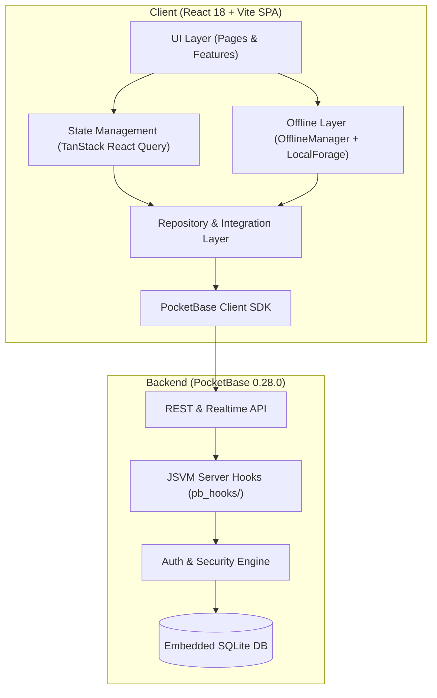
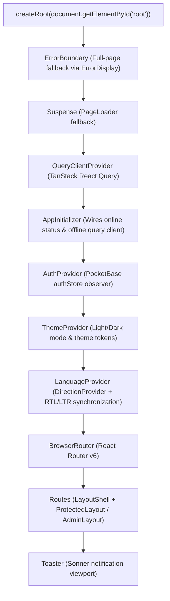
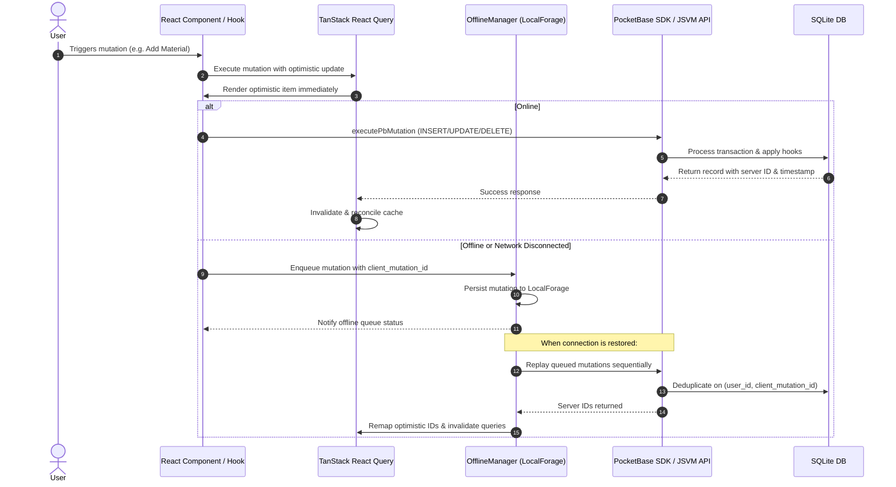

# System Architecture

This document describes the high-level system architecture, component hierarchies, state management patterns, and design principles of BinaaCost.

---

## 1. High-Level Architecture

The application is structured as a single-page application (SPA) built with React and Vite, backed by PocketBase (SQLite-based auth, database, and JSVM hooks).



---

## 2. Directory & Boundary Architecture

The frontend follows a feature-driven modular structure with strict separation between feature domains, shared primitives, and infrastructural integrations.

```text
src/
├── app/                  # Application shell, routing guards, and global providers
│   ├── layout/           # LayoutShell, Sidebar, Topbar, Breadcrumbs
│   ├── providers/        # AuthProvider, ThemeProvider, LanguageProvider
│   └── router/           # ProtectedRoute, AdminRoute (role-based access)
├── features/             # Business modules grouped by domain
│   ├── admin/            # User administration, project controls, audit logs, system settings
│   ├── auth/             # Login, authentication hooks, role evaluation
│   ├── cost-library/     # Cost databases, CSI divisions, resource assemblies, user libraries
│   ├── projects/         # Core project management and cost estimation
│   │   ├── project-core/       # Project CRUD, overview dashboard, item comments, project groups
│   │   ├── project-costs/      # Line items: Materials, Labor, Equipment, Additional Costs, Risks
│   │   ├── project-analytics/  # Scenario simulation, sensitivity modeling
│   │   ├── project-reports/    # Proposal generator, QC checks, PDF formatting
│   │   ├── project-sharing/    # Team collaborator permissions, external share links
│   │   └── project-versions/   # Version snapshots, visual diffs, conflict resolution, restore
│   ├── reports/          # Cross-project reporting utilities and PDF export hooks
│   └── settings/         # Profile management, company financial defaults, credentials
├── integrations/         # External service drivers and SDK bridges
│   └── pocketbase/       # PocketBase client instance, repository implementations, custom routes
├── pages/                # Route-level views rendered by React Router
├── shared/               # Cross-cutting primitives and domain logic (shared across 3+ features)
│   ├── components/       # Common UI elements (Modals, Headers, Tables, Sync indicators)
│   │   └── ui/           # Radix UI + Tailwind design system primitives (shadcn-inspired)
│   ├── hooks/            # Generic hooks (currency conversion, date formatting, responsiveness)
│   ├── lib/              # Utilities (OfflineManager, formatting, math, sanitization)
│   └── logic/            # Pure business logic (financial formulas, contingency, version diffing)
├── globals.css           # Tailwind base styles, theme tokens, WCAG compliance rules
├── i18n.ts               # i18next runtime initialization and namespace registry
└── main.tsx              # Application bootstrap, root providers, error boundary
```

### Module Ownership Rule
- Code belonging to a single domain lives inside `src/features/<feature>/`.
- Sub-features are isolated within their parent domain (e.g. `src/features/projects/project-costs/`).
- Code is promoted to `src/shared/` **only when required across three or more features**.
- Types are co-located with the specific feature or shared domain to which they pertain; there is no global catch-all types folder.

---

## 3. Application Lifecycle & Provider Tree

The application initializes through a layered provider tree in [src/main.tsx](../src/main.tsx) and [src/App.tsx](../src/App.tsx):



### Route Protection Hierarchy
- **Public Routes**:
  - `/login`: User authentication form.
  - `/public-share/:accessToken`: Public read-only view protected by share token, expiration, and optional password.
- **Protected User Routes** (`ProtectedLayout`):
  - Wraps routes inside [ProtectedRoute.tsx](../src/app/router/ProtectedRoute.tsx).
  - Redirects unauthenticated visitors to `/login`.
  - Mounts [LayoutShell.tsx](../src/app/layout/LayoutShell.tsx) with standard navigation, sidebar, and breadcrumbs.
  - Renders child routes via React Router `<Outlet />`.
- **Protected Administrator Routes** (`AdminLayout`):
  - Wraps routes inside [AdminRoute.tsx](../src/app/router/AdminRoute.tsx).
  - Enforces `role === "super_admin"`. Unprivileged users are redirected to `/` with an access denied alert.

---

## 4. State Management & Data Flow

Data flow follows a unidirectional pattern mediated by TanStack React Query and PocketBase:



### Stale Time Policies
Query caching is standardized using predefined cache invalidation policies ([src/shared/lib/queryDefaults.ts](../src/shared/lib/queryDefaults.ts)):
- `STATIC` (15 minutes): Currency exchange rates, dropdown options, application configuration.
- `DYNAMIC` (0 seconds): Cost line items, project summaries, comment threads. Refetched on mount; never refetched on window focus to avoid interrupting in-progress edits.

---

## 5. Responsive & Mobile Architecture

The application is engineered to operate seamlessly across desktops, tablets, and mobile devices:
- **Breakpoint System**: Standard Tailwind breakpoints (`sm: 640px`, `md: 768px`, `lg: 1024px`, `xl: 1280px`).
- **Dynamic View Adaptation**: [src/shared/hooks/useMobile.ts](../src/shared/hooks/useMobile.ts) detects screen widths below `768px`.
- **Tabs to Dropdown Transformation**: Tab navigations in [ProjectTabs.tsx](../src/features/projects/project-core/components/ProjectTabs.tsx) and [CostLibrary.tsx](../src/pages/cost-library/CostLibrary.tsx) automatically convert into select dropdowns on mobile screens to prevent layout overflow.
- **Card-Based Mobile Tables**: Dense desktop tables convert to touch-friendly card views with inline action buttons on mobile screens.

---

## 6. Progressive Web App (PWA) Implementation

Offline loading and installation capabilities are powered by `vite-plugin-pwa` ([vite.config.ts](../vite.config.ts)):
- **Service Worker Registration**: `autoUpdate` mode injects a service worker that automatically updates assets in the background.
- **Workbox Caching**: Pre-caches static assets matching `**/*.{js,css,html,ico,png,svg,webmanifest}` with automatic cache cleanup for obsolete versions.
- **Manifest Configuration**: Declares name, theme colors (`#ffffff`), and icons (`192x192`, `512x512`, and `maskable-icon-512x512`).
- **Offline Fallback**: Serves [public/offline.html](../public/offline.html) when network navigation fails.
- **Queue Notification**: Changes made while disconnected are queued via `OfflineManager` and rendered with status banners via [OfflineSyncIndicator.tsx](../src/shared/components/OfflineSyncIndicator.tsx).
