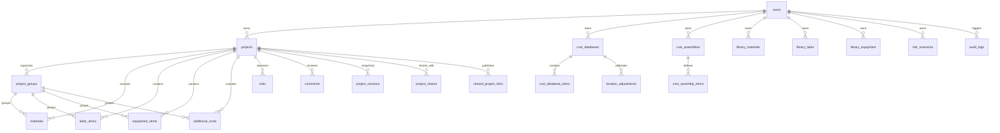

# Database & Schema Reference

This document documents the database structure, entities, relationships, constraints, indexes, and migrations of the BinaaCost backend.

---

## 1. Entity-Relationship Model

---

## 2. Core Collections

### `users` (Auth Collection)
The user authentication and profile store.

| Field | Type | Attributes | Description |
| :--- | :--- | :--- | :--- |
| `id` | text (15) | Primary Key | PocketBase generated alphanumeric ID |
| `email` | email | Unique, Required | User login email address |
| `password` | password | Required | Bcrypt-hashed user password |
| `role` | select | Values: `["user", "super_admin"]` | Global system role (default: `user`) |
| `first_name` | text | Optional | User given name |
| `last_name` | text | Optional | User family name |
| `notification_prefs` | json | Optional | JSON object storing user alert preferences |
| `emailVisibility` | bool | Default: `true` | Visibility flag managed by server hooks |

### `projects`
Core project metadata and high-level financial parameters.

| Field | Type | Attributes | Description |
| :--- | :--- | :--- | :--- |
| `id` | text (15) | Primary Key | Unique project identifier |
| `user_id` | relation (`users`) | Required, Cascade: false | Project owner reference |
| `name` | text | Required | Human-readable project title |
| `description` | text | Optional | Detailed project scope or narrative |
| `type` | text | Optional | Project classification (Residential, Commercial, etc.) |
| `size` | text | Optional | Numerical magnitude or surface area |
| `size_unit` | text | Optional | Unit of size (sqm, sqft, acre, hectare) |
| `location` | text | Optional | Project location or jurisdiction |
| `client_requirements`| text | Optional | Notes on owner specifications or contract bounds |
| `duration_days` | number | Min: 0 | Expected schedule duration in days |
| `duration_unit` | text | Optional | Display unit for duration (Day, Month, Week, Year) |
| `currency` | text | Required | Default project currency (e.g. `USD`, `SAR`, `EUR`) |
| `financial_settings` | json | Optional | Overheads, markups, tax, location factor, contingency |
| `financial_settings_confirmed` | bool | Optional | Locks financial settings confirmation |
| `client_mutation_id` | text | Scoped Unique | Offline idempotency token per user |
| `deleted_at` | date | Optional | Soft-delete timestamp (null if active) |

### `project_groups`
Cost breakdown structure (WBS) groupings within a project.

| Field | Type | Attributes | Description |
| :--- | :--- | :--- | :--- |
| `id` | text (15) | Primary Key | Unique group identifier |
| `project_id` | relation (`projects`) | Required, Cascade: true | Parent project reference |
| `user_id` | relation (`users`) | Required, Cascade: false | Owning user reference |
| `name` | text | Required | Group name (e.g. "Substructure", "Electrical") |
| `sort_order` | number | Integer | Presentation order within tabs |
| `client_mutation_id` | text | Scoped Unique | Offline idempotency token per user |

---

## 3. Project Line Item Collections

Each project line item is linked to a parent `project_id` and optionally assigned to a `group_id`. All numeric quantities and rates enforce `min: 0` constraints.

### `materials`
Bill of materials for the project.
- `project_id` (relation to `projects`, cascade: true)
- `user_id` (relation to `users`, cascade: false)
- `group_id` (relation to `project_groups`, optional)
- `name` (text, required)
- `description` (text, optional)
- `quantity` (number, required, min: 0)
- `unit` (text, optional, e.g. `m2`, `kg`, `pcs`)
- `unit_price` (number, optional, min: 0)
- `supplier_options` (json, optional)
- `client_mutation_id` (text, scoped unique)

### `labor_items`
Labor force estimates broken down by trade and duration.
- `project_id` (relation to `projects`, cascade: true)
- `user_id` (relation to `users`, cascade: false)
- `group_id` (relation to `project_groups`, optional)
- `worker_type` (text, required, e.g. "Carpenter", "Electrician")
- `description` (text, optional)
- `number_of_workers` (number, optional, min: 0)
- `daily_rate` (number, optional, min: 0)
- `total_days` (number, optional, min: 0)
- `total_cost` (number, optional, min: 0) — calculated: `workers * daily_rate * total_days`
- `client_mutation_id` (text, scoped unique)

### `equipment_items`
Machinery, tooling, and plant rentals or purchases.
- `project_id` (relation to `projects`, cascade: true)
- `user_id` (relation to `users`, cascade: false)
- `group_id` (relation to `project_groups`, optional)
- `name` (text, required)
- `type` (text, optional)
- `rental_or_purchase` (text, optional, "Rental" or "Purchase")
- `quantity` (number, optional, min: 0)
- `cost_per_period` (number, optional, min: 0)
- `period_unit` (text, optional, e.g. "day", "month")
- `usage_duration` (number, optional, min: 0)
- `maintenance_cost` (number, optional, min: 0)
- `fuel_cost` (number, optional, min: 0)
- `total_cost` (number, optional, min: 0) — calculated: `(quantity * cost_per_period * duration) + maintenance + fuel`
- `client_mutation_id` (text, scoped unique)

### `additional_costs`
Lump-sum fees, permits, testing, insurance, and utilities.
- `project_id` (relation to `projects`, cascade: true)
- `user_id` (relation to `users`, cascade: false)
- `group_id` (relation to `project_groups`, optional)
- `category` (text, required, e.g. "Permits", "Insurance", "Transport")
- `description` (text, optional)
- `amount` (number, optional, min: 0)
- `client_mutation_id` (text, scoped unique)

### `risks`
Risk register assessing uncertainties and expected monetary value.
- `project_id` (relation to `projects`, cascade: true)
- `user_id` (relation to `users`, cascade: false)
- `description` (text, required)
- `probability` (text, optional, "Low", "Medium", "High")
- `impact_amount` (number, optional, min: 0)
- `mitigation_plan` (text, optional)
- `contingency_amount` (number, optional, min: 0)
- `client_mutation_id` (text, scoped unique)

### `comments`
Item-level collaboration comments.
- `project_id` (relation to `projects`, cascade: true)
- `user_id` (relation to `users`, cascade: false)
- `content` (text, required)
- `item_id` (text, optional)
- `item_type` (text, optional)
- `client_mutation_id` (text, scoped unique)

---

## 4. Collaboration, Sharing & Versioning

### `project_shares`
Internal collaborator assignments.
- `project_id` (relation to `projects`, cascade: true)
- `shared_with_user_id` (relation to `users`, cascade: true)
- `shared_with_email` (text, optional)
- `role` (select: `["viewer", "editor"]`, required)

### `shared_project_links`
External public links for third-party review.
- `project_id` (relation to `projects`, cascade: true)
- `created_by_user_id` (relation to `users`, cascade: false)
- `token_hash` (text, required, unique) — SHA-256 hash of the 48-character access token
- `password` (password field) — PocketBase-hashed password for link access
- `expires_at` (date, required) — Expiration timestamp

### `project_versions`
Point-in-time project snapshots.
- `project_id` (relation to `projects`, cascade: true)
- `user_id` (relation to `users`, cascade: false)
- `created_by_user_id` (relation to `users`, cascade: false)
- `name` (text, required)
- `is_final` (bool, default: false) — When true, version is locked and immutable
- `data` (json) — Complete frozen state: project metadata, child arrays, pre-calculated totals, and financial summaries

---

## 5. Cost Library & User Resources

- `cost_databases`: Master cost databases (can be private or public).
- `cost_database_items`: Standardized items indexed by `csi_division`, `csi_code`, `description`, `unit`, and `unit_price`.
- `location_adjustments`: City-specific cost index multipliers per database.
- `cost_assemblies`: Composite assembly templates (e.g. "Interior Partition Wall").
- `cost_assembly_items`: Multi-trade items comprising an assembly (`material`, `labor`, `equipment`, `additional`).
- `library_materials`, `library_labor`, `library_equipment`: Personal user libraries storing reusable default unit rates.

---

## 6. System & Administration Collections

- `currency_rates`: Base currency exchange rates (`currency_code`, `rate_to_usd`).
- `dropdown_settings`: Customizable presets for project types, units, categories, and probabilities with bilingual translations (`en`, `ar`).
- `app_settings`: Key-value application settings (e.g. `user_signup` toggle).
- `audit_logs`: Detailed audit trail tracking every `CREATE`, `UPDATE`, and `DELETE` on 22 collections.

---

## 7. Database Indexes & Integrity Constraints

| Table | Index / Constraint | Purpose |
| :--- | :--- | :--- |
| `projects` | `idx_projects_user_deleted (user_id, deleted_at)` | Fast project filtering by owner and active status |
| `cost_database_items` | `CREATE UNIQUE INDEX idx_cdi_db_csi ON cost_database_items (database_id, csi_code)` | Enforces unique CSI code per database; eliminates import race conditions |
| `shared_project_links`| `CREATE UNIQUE INDEX idx_shared_project_links_token ON shared_project_links (token_hash)` | Fast, unique lookup for share link tokens |
| All line item tables | `CREATE UNIQUE INDEX idx_{table}_user_cmid ON {table} (user_id, client_mutation_id) WHERE client_mutation_id IS NOT NULL AND client_mutation_id != ''` | Scopes offline idempotency tokens per user |
| All line item tables | `min: 0` on quantities, prices, rates, and amounts | Prevents negative numbers from corrupting calculations |
| User relations | `cascadeDelete: false` on `user_id` | Deleting a user does not delete shared project line items or library resources |
