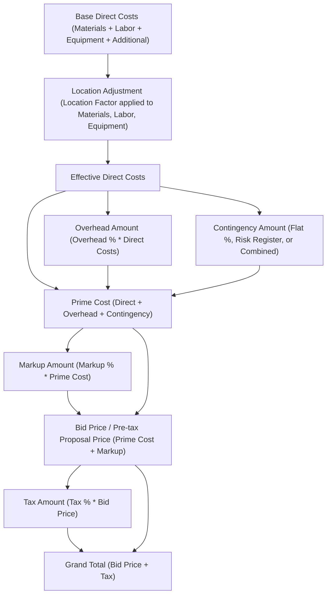

# Financial Engine & Pricing Logic

This document details the business logic, mathematical formulas, rounding behavior, and currency conversion mechanics implemented in BinaaCost.

---

## 1. Core Principles: Decimal Arithmetic & Rounding

To ensure that calculations reconcile across client and server environments without floating-point drift:

1. **Client Implementation**:
   - Built using `decimal.js` ([src/shared/lib/math.ts](../src/shared/lib/math.ts)).
   - Intermediate and final values are rounded half-up to two decimal places via `.toDecimalPlaces(2)`.
2. **Server Implementation (JSVM)**:
   - Built using integer-cents arithmetic (`Math.round(n * 100)`) and round-half-up math (`Math.round((n + Number.EPSILON) * 100) / 100`).
3. **Reconciliation Guarantee**:
   - Every displayed step in the financial cascade (`direct + overhead + contingency + markup + tax = grand total`) sums exactly without off-by-one-cent rounding discrepancies.

---

## 2. Category Direct Cost Formulas

Cost items are aggregated into direct costs before project loadings are applied ([src/shared/logic/shared.ts](../src/shared/logic/shared.ts)):

### 1. Materials Total
$$\text{Materials Total} = \sum (\text{quantity} \times \text{unit\_price})$$

### 2. Labor Total
$$\text{Labor Total} = \sum (\text{number\_of\_workers} \times \text{daily\_rate} \times \text{total\_days})$$

### 3. Equipment Total
For each equipment item:
- **Rental**:
  $$\text{Item Cost} = (\text{quantity} \times \text{cost\_per\_period} \times \text{usage\_duration}) + \text{maintenance\_cost} + \text{fuel\_cost}$$
- **Purchase**:
  $$\text{Item Cost} = (\text{quantity} \times \text{cost\_per\_period} \times 1) + \text{maintenance\_cost} + \text{fuel\_cost}$$

$$\text{Equipment Total} = \sum \text{Item Cost}$$

### 4. Additional Costs Total
$$\text{Additional Costs Total} = \sum \text{amount}$$

---

## 3. Financial Cascade Formulas

The complete financial summary is computed by [calculateProjectFinancials](../src/shared/logic/financials.ts):

### Step-by-Step Mathematical Definitions

#### 1. Location Adjustment
The `location_factor` multiplier (default: `1.0`) is applied to physical trades (Materials, Labor, Equipment). It is **not** applied to Additional Costs (which represent fixed lump sums):
$$\text{Materials}_{\text{adj}} = \text{round}_2(\text{Materials Total} \times \text{location\_factor})$$
$$\text{Labor}_{\text{adj}} = \text{round}_2(\text{Labor Total} \times \text{location\_factor})$$
$$\text{Equipment}_{\text{adj}} = \text{round}_2(\text{Equipment Total} \times \text{location\_factor})$$

$$\text{Direct Costs} = \text{round}_2(\text{Materials}_{\text{adj}} + \text{Labor}_{\text{adj}} + \text{Equipment}_{\text{adj}} + \text{Additional Total})$$
$$\text{Direct Costs Base} = \text{round}_2(\text{Materials Total} + \text{Labor Total} + \text{Equipment Total} + \text{Additional Total})$$
$$\text{Location Adjustment Amount} = \text{round}_2(\text{Direct Costs} - \text{Direct Costs Base})$$

#### 2. Overhead Amount
$$\text{Overhead Amount} = \text{round}_2\left(\text{Direct Costs} \times \frac{\text{overhead\_percent}}{100}\right)$$

#### 3. Contingency Amount
The contingency is evaluated based on `contingency_basis`:
- **`flat`**:
  $$\text{Contingency Amount} = \text{round}_2\left(\text{Direct Costs} \times \frac{\text{contingency\_percent}}{100}\right)$$
- **`risk_register`**:
  $$\text{Contingency Amount} = \text{round}_2(\text{Risk Contingency})$$
- **`combined`**:
  $$\text{Contingency Amount} = \text{round}_2\left(\text{round}_2\left(\text{Direct Costs} \times \frac{\text{contingency\_percent}}{100}\right) + \text{Risk Contingency}\right)$$

#### 4. Prime Cost
$$\text{Prime Cost} = \text{round}_2(\text{Direct Costs} + \text{Overhead Amount} + \text{Contingency Amount})$$

#### 5. Markup Amount & Bid Price
$$\text{Markup Amount} = \text{round}_2\left(\text{Prime Cost} \times \frac{\text{markup\_percent}}{100}\right)$$
$$\text{Bid Price} = \text{round}_2(\text{Prime Cost} + \text{Markup Amount})$$

#### 6. Tax Amount & Grand Total
$$\text{Tax Amount} = \text{round}_2\left(\text{Bid Price} \times \frac{\text{tax\_percent}}{100}\right)$$
$$\text{Grand Total} = \text{round}_2(\text{Bid Price} + \text{Tax Amount})$$

#### 7. Gross Margin Percentage
The pre-tax profitability metric is calculated against Bid Price (Revenue):
$$\text{Gross Margin \%} = \begin{cases} 0 & \text{if Bid Price} = 0 \\ \text{round}_2\left(\frac{\text{Markup Amount}}{\text{Bid Price}} \times 100\right) & \text{otherwise} \end{cases}$$

---

## 4. Risk Register Calculations

Risk contingency is calculated in [src/shared/logic/risk.ts](../src/shared/logic/risk.ts):
- For each risk item:
  $$\text{Item Risk Contingency} = \text{impact\_amount} \times \text{probability\_weight}$$
- Default weights (fallback when dropdown presets lack a numeric value):
  - Low: `0.1` (10%)
  - Medium: `0.3` (30%)
  - High: `0.5` (50%)
- When `dropdown_settings` defines a `numeric_value` for a probability option (e.g. Low = 0.1, Medium = 0.5, High = 0.9 in database seeds), the customized numeric weight is used.
- If `contingency_amount` is manually overridden on an individual risk item, the explicit contingency amount takes precedence.

---

## 5. Currency Conversion

Project currencies can be converted atomically via `POST /api/projects/{id}/convert-currency` ([pocketbase/pb_hooks/convert_currency.pb.js](../pocketbase/pb_hooks/convert_currency.pb.js)):
1. Both currencies must exist in `currency_rates` with positive `rate_to_usd` values.
2. The conversion factor is computed:
   $$\text{Conversion Factor} = \frac{\text{rate\_to\_usd}(\text{new\_currency})}{\text{rate\_to\_usd}(\text{old\_currency})}$$
3. Inside a transaction, all monetary fields are multiplied by the factor and rounded to two decimal places:
   - `materials.unit_price`
   - `labor_items.daily_rate`, recalculating `total_cost`
   - `equipment_items.cost_per_period`, `maintenance_cost`, `fuel_cost`, recalculating `total_cost`
   - `additional_costs.amount`
   - `risks.impact_amount`, `contingency_amount`
4. The project's `currency` field is updated to `new_currency`.
