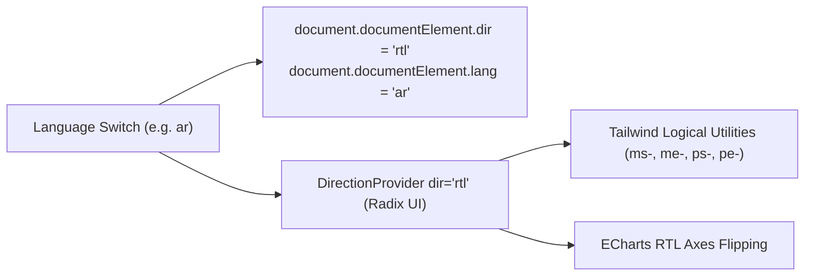

# Internationalization (i18n) & RTL Architecture

This document describes the internationalization system, English and Arabic localization, Right-to-Left (RTL) styling rules, font integration, and dictionary parity verification.

---

## 1. Supported Languages & Setup

The application natively supports two languages:
1. **English (`en`)**: Left-to-Right (LTR), default fallback language.
2. **Arabic (`ar`)**: Right-to-Left (RTL), full localized interface.

Runtime internationalization is powered by `i18next` and `react-i18next` ([src/i18n.ts](../src/i18n.ts)):
- **Backend Loader**: `i18next-http-backend` loads JSON dictionaries dynamically from `/locales/{{lng}}/{{ns}}.json`.
- **Language Detection**: `i18next-browser-languagedetector` inspects query string (`?lng=ar`), cookies, local storage, and path.
- **Default Namespace**: `common`.

---

## 2. Translation Namespaces (`public/locales/`)

Dictionaries are split into 24 distinct namespaces to allow modular loading and maintainable key sets:

```text
public/locales/
├── en/
│   ├── admin.json
│   ├── auth.json
│   ├── common.json
│   ├── dashboard.json
│   ├── durations.json
│   ├── errors.json
│   ├── navigation.json
│   ├── pages.json
│   ├── project_additional.json
│   ├── project_costs.json
│   ├── project_detail.json
│   ├── project_equipment.json
│   ├── project_form.json
│   ├── project_labor.json
│   ├── project_materials.json
│   ├── project_overview.json
│   ├── project_reports.json
│   ├── project_risk.json
│   ├── project_tabs.json
│   ├── project_versions.json
│   ├── resources.json
│   ├── roles.json
│   ├── scenario_analysis.json
│   └── settings.json
└── ar/
    └── (Exact same 24 namespace files mirroring en/)
```

---

## 3. Right-to-Left (RTL) Architecture

RTL orientation is coordinated through [LanguageProvider.tsx](../src/app/providers/LanguageProvider.tsx) and Radix UI's `DirectionProvider`:



### Styling Rules for RTL Compatibility
Contributors must follow these styling rules:
1. **Never use directional margins or paddings**:
   - ❌ Bad: `ml-4`, `mr-2`, `pl-6`, `pr-3`
   - ✅ Good: `ms-4` (margin-inline-start), `me-2` (margin-inline-end), `ps-6` (padding-inline-start), `pe-3` (padding-inline-end)
2. **Use logical text alignment**:
   - ❌ Bad: `text-left`, `text-right`
   - ✅ Good: `text-start`, `text-end`
3. **Directional Icons**:
   - For back buttons or progression chevrons, rotate the icon when in RTL mode:
     ```tsx
     <ArrowLeft className={cn("w-5 h-5", i18n.dir() === "rtl" && "rotate-180")} />
     ```

---

## 4. Typography & Font Integration

Arabic typography requires specific font treatment for readability:
- **Font Family**: `Noto Sans Arabic` is loaded via Google Fonts in [index.html](../index.html) (`weights: 400, 700`).
- **Base Fallbacks**: Configured in [globals.css](../src/globals.css) and [tailwind.config.ts](../tailwind.config.ts) to fall back gracefully to system sans-serif fonts.

---

## 5. Automated Locale Parity Verification

To prevent untranslated keys from leaking into the UI:
- Vitest executes [locale-parity.test.ts](../src/shared/lib/__tests__/locale-parity.test.ts).
- The test verifies:
  1. Both `en/` and `ar/` have the identical set of namespace files.
  2. Every key in English exists in Arabic, and vice-versa (normalizing plural suffixes `_zero`, `_one`, `_two`, `_few`, `_many`, `_other`).
  3. No empty strings exist in either locale dictionary.

Run the parity test:
```bash
pnpm test src/shared/lib/__tests__/locale-parity.test.ts
```
