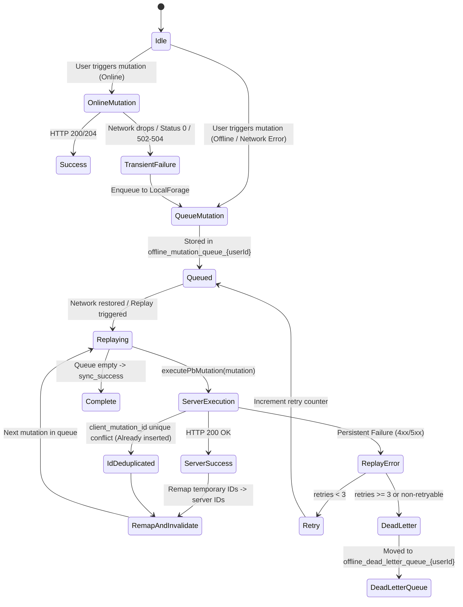

# Offline Architecture & Synchronization

This document describes the offline-first architecture, optimistic updates, LocalForage mutation queue, synchronization replay engine, ID remapping, and dead-letter handling in BinaaCost.

---

## 1. Overview

The application is built to allow continuous project estimation and editing even during network dropouts or complete offline environments.



---

## 2. Supported Mutation Types

The offline manager ([src/shared/lib/offline.ts](../src/shared/lib/offline.ts)) and executor ([src/integrations/pocketbase/executor.ts](../src/integrations/pocketbase/executor.ts)) support 7 operation types:

| Mutation Type | Description | Idempotency / Server Behavior |
| :--- | :--- | :--- |
| `INSERT` | Creates a new record in a collection | Strips client-generated optimistic IDs. Uses `client_mutation_id` to deduplicate retries. |
| `UPDATE` | Updates fields on an existing record | Strips `user_id` so update rules pass. Uses OCC timestamps to detect stale edits. |
| `DELETE` | Removes a record by ID | Deletes record; gracefully treats missing (404) records as already deleted. |
| `BULK_DELETE` | Removes multiple records by ID array | Executes sequential deletion per ID. |
| `BULK_UPDATE` | Updates multiple records with payload | Executes sequential updates per ID, stripping `user_id`. |
| `UPSERT` | Upserts item based on natural keys | Dispatches to custom `/api/upsert/*` JSVM route. |
| `RPC` | Custom server procedure call | Dispatches to custom `/api/*` JSVM route. |

---

## 3. Transient Error Detection

When a mutation is initiated online, [useOfflinePb](../src/integrations/pocketbase/hooks/useOfflinePb.ts) executes the request. If an error occurs, `isNetworkOrTransientError(error)` inspects the failure:
- HTTP status `0` (client offline or connection aborted).
- HTTP gateway statuses `502`, `503`, and `504`.
- Network error codes: `ECONNREFUSED`, `ENOTFOUND`, `ETIMEDOUT`, `ECONNRESET`.
- Error messages containing `Failed to fetch`, `network error`, or `timeout`.

If an error is transient, the mutation is automatically routed into the offline queue instead of throwing an unhandled exception to the user.

---

## 4. Idempotency via `client_mutation_id`

When inserting items offline or in unstable network conditions, duplicate submissions can occur if a response is lost in transit.
1. Every newly created record receives a unique `client_mutation_id` (UUID generated via `crypto.randomUUID()`).
2. The database maintains a partial unique index:
   ```sql
   CREATE UNIQUE INDEX idx_{table}_user_cmid ON {table} (user_id, client_mutation_id) 
   WHERE client_mutation_id IS NOT NULL AND client_mutation_id != '';
   ```
3. If a retried insert hits this unique constraint, PocketBase returns a constraint error.
4. The replay engine identifies this error via `isClientMutationIdConflict()` and treats the operation as a successful insert, preventing duplicate rows.

---

## 5. Optimistic ID Remapping

When a user creates a record offline (e.g. a `project_groups` item) and immediately attaches items to it (e.g. `materials`), the child items reference the temporary client-generated ID of the group.

During replay:
1. When the group record is created on the server, the server assigns a permanent 15-character PocketBase ID (e.g. `abc123def456ghi`).
2. `OfflineManager` records the mapping: `idMap.set(optimisticId, serverId)`.
3. An `id_remapped` event is emitted:
   - Components such as [ProjectDetail.tsx](../src/pages/projects/ProjectDetail.tsx) update the browser URL if the active project ID was remapped.
4. All subsequent mutations in the queue have their payloads (`remapPayload`) and query keys (`remapQueryKey`) remapped recursively before being sent to the server.

---

## 6. Dead-Letter Queue & UI Inspection

If a mutation fails with a non-transient error or exceeds `MAX_RETRIES = 3`:
1. The mutation is removed from the active queue and appended to `offline_dead_letter_queue_{userId}` in LocalForage.
2. The user is notified via a warning toast with an action button to open the **Dead-Letter Drawer**.
3. [DeadLetterDrawer.tsx](../src/shared/components/DeadLetterDrawer.tsx) enables users to:
   - View failed mutations and error messages.
   - Re-attempt individual or all failed mutations.
   - Discard unresolvable mutations.

---

## 7. Storage Scoping & Multi-User Isolation

To prevent cross-tenant contamination on shared devices:
- All LocalForage keys are scoped by the authenticated user's ID:
  - `offline_mutation_queue_<userId>`
  - `offline_dead_letter_queue_<userId>`
- When a user logs out, `offlineManager.reset()` clears memory state.
- When a user logs in, `offlineManager.init(userId)` loads only that user's queue.
