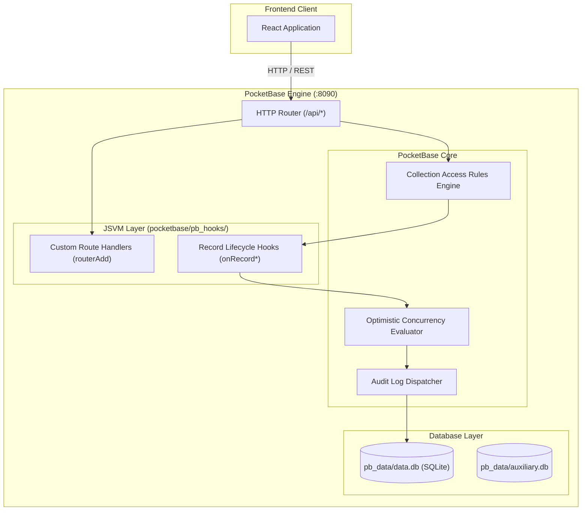

# PocketBase Architecture & Server Integration

This document details the backend architecture powered by PocketBase (version 0.28.0), including database collections, server-side JavaScript Virtual Machine (JSVM) hooks, security and authorization rules, optimistic concurrency control, and migrations.

---

## 1. PocketBase Backend Overview

PocketBase serves as the complete backend for BinaaCost. It provides:
- Embedded SQLite database engine with zero external database dependencies.
- Built-in user authentication and session management (`users` auth collection).
- JSVM (Goja-based JavaScript runtime) running event hooks and custom REST route handlers in `pocketbase/pb_hooks/`.
- Automated schema migration runner executing JavaScript migrations in `pocketbase/pb_migrations/`.



---

## 2. Server Hooks Reference (`pocketbase/pb_hooks/`)

All server extensions are written in JavaScript for PocketBase's embedded JSVM. Each hook file is self-contained: helper functions are declared within the handler scope to prevent Goja closure isolation issues.

| Hook File | Responsibilities | Endpoints / Events Registered |
| :--- | :--- | :--- |
| `admin_users.pb.js` | Super-admin user management: creating users, updating profiles, toggling roles, deleting accounts. Protects against self-deletion and demoting or deleting the last remaining `super_admin`. Enforces email visibility for administrators. | `POST /api/admin/users/create`<br>`POST /api/admin/users/{id}/role`<br>`POST /api/admin/users/{id}/update`<br>`POST /api/admin/users/{id}/delete`<br>`onRecordCreate (users)`<br>`onRecordsListRequest (users)`<br>`onRecordViewRequest (users)` |
| `audit_log.pb.js` | Data-driven audit logging for 22 tracked collections. Generates compact field-level diffs on updates, logs creators and actors, and strips sensitive credential fields (`password`, `tokens`, etc.). | `onRecordCreateRequest`<br>`onRecordUpdateRequest`<br>`onRecordDeleteRequest`<br>`onRecordAfterCreateSuccess`<br>`onRecordAfterUpdateSuccess`<br>`onRecordAfterDeleteSuccess` |
| `convert_currency.pb.js` | Atomic multi-table project currency conversion. Queries exchange rates from `currency_rates`, scales monetary fields across materials, labor, equipment, additional costs, and risks by `rateNew / rateOld`, recalculates total item costs, and updates project currency inside a transaction. | `POST /api/projects/{id}/convert-currency` |
| `editor_permissions.pb.js` | Enforces financial authorization. Blocks project editors and shared collaborators from modifying `financial_settings` or `financial_settings_confirmed`. Only project owners and `super_admin` can edit financial parameters. | `onRecordUpdateRequest (projects)` |
| `users_soft_delete.pb.js` | Intercepts user deletion to implement soft-deletes. Sets `deleted_at` and scrambles the email and username to free them up for re-registration without destroying orphaned data. | `onRecordDeleteRequest (users)` |
| `import_db_items.pb.js` | High-throughput bulk CSV import into `cost_database_items` (up to 5,000 items per batch). Verifies database ownership, dedupes against `(database_id, csi_code)`, and supports both `"skip"` and `"overwrite"` conflict resolution strategies. | `POST /api/import/cost_database_items` |
| `project_concurrency.pb.js` | Optimistic Concurrency Control (OCC). Compares incoming `updated` timestamps against stored database timestamps across 10 collections. Rejects stale client writes with HTTP `409 Conflict`. | `onRecordUpdateRequest` (10 collections) |
| `project_versions.pb.js` | Finalized version immutability. Intercepts update and delete requests on `project_versions` where `is_final: true`, throwing a `ForbiddenError`. | `onRecordUpdateRequest (project_versions)`<br>`onRecordDeleteRequest (project_versions)` |
| `public_share.pb.js` | Serves public project estimates via 48-character tokens. Validates optional password gates with brute-force rate limiting (maximum 20 failed attempts per 10-minute window stored in `$app.store()`). Redacts raw risk registers for client privacy while computing accurate totals on the server. | `POST /api/share/{token}` |
| `share_cleanup.pb.js` | Cleans up orphaned links and cascades ownership changes. When an editor share is revoked, deletes any external share links created by that editor. When project ownership is transferred, reassigns all child items and links to the new owner. | `onRecordAfterDeleteSuccess (project_shares)`<br>`onRecordAfterUpdateSuccess (projects)` |
| `share_links.pb.js` | Generates external share links with cryptographically secure random tokens. Stores tokens as SHA-256 hashes (`token_hash`) and hashes passwords using PocketBase's native password hashing. | `POST /api/projects/{id}/share-links` |
| `simulate.pb.js` | Server-side scenario simulation engine. Executes complex sensitivity adjustments (percentage, fixed, or risk realization) against project materials, labor, equipment, and financial loadings without mutating live project data. | `POST /api/projects/{id}/simulate` |
| `upsert.pb.js` | Deduplicated library item synchronization. Upserts records in `library_materials`, `library_labor`, and `library_equipment` based on natural keys (e.g. name + unit for materials, worker_type for labor). | `POST /api/upsert/library_materials`<br>`POST /api/upsert/library_labor`<br>`POST /api/upsert/library_equipment` |
| `user_resolve.pb.js` | Email-to-user-ID resolver for collaborator invitations. Allows authenticated users to look up the ID of an account by email without exposing the user directory. | `POST /api/users/resolve` |
| `users_minimal.pb.js` | Batch identity resolution for project collaborators, commenters, and share lists. Restricts lookups to self, co-collaborators on shared projects, or super-admins to prevent directory enumeration. | `POST /api/users/minimal` |
| `versions.pb.js` | Project snapshot creation and version restoration. Pre-calculates and freezes financial summaries upon snapshot creation. Restores project children and group associations atomically within a transaction, with optional rollback snapshot capture. | `POST /api/projects/{id}/versions`<br>`POST /api/versions/{id}/finalize`<br>`POST /api/versions/{id}/apply` |

---

## 3. Security & Authorization Model

PocketBase manages authorization using declarative collection access rules combined with imperative JSVM hooks.

### User Roles
The application defines exactly two system-wide user roles:
1. `user`: Standard application user.
2. `super_admin`: Platform administrator with full access to administration views, user management, and audit logs.

> [!NOTE]
> Project roles (`viewer` and `editor`) are **scoped per project** in the `project_shares` collection. They do not exist as global roles in the `users` collection.

### Collection Access Rules Summary

| Collection | List / View Rule | Create Rule | Update Rule | Delete Rule |
| :--- | :--- | :--- | :--- | :--- |
| `users` | Own record or `super_admin` | Unauthenticated / Super Admin (role must be blank or `user` unless created by `super_admin`) | Own record (cannot modify `role` directly) | Super Admin only (via `/api/admin/users/{id}/delete`) |
| `projects` | Owner, shared collaborator, or `super_admin` | Authenticated; `user_id` must match caller | Owner, editor, or `super_admin` (`user_id` immutable) | Owner or `super_admin` |
| Child items (`materials`, `labor_items`, etc.) | Owner, shared collaborator, or `super_admin` | Owner or editor | Owner, editor, or `super_admin` (`user_id` immutable) | Owner, editor, or `super_admin` |
| `project_shares` | Project owner or invitee | Project owner only | Project owner only | Project owner or invitee |
| `shared_project_links` | Project owner, editor who created it, or `super_admin` | Blocked via standard API (Must use `/api/projects/{id}/share-links`) | Blocked | Project owner, creating editor, or `super_admin` |
| `project_versions` | Project owner, shared collaborator, or `super_admin` | Blocked via standard API (Must use `/api/projects/{id}/versions`) | Owner or `super_admin` (finalized versions blocked by hook) | Owner or `super_admin` (finalized versions blocked by hook) |
| `cost_databases` | Owner, public database, or `super_admin` | Authenticated; `user_id` must match caller | Owner or `super_admin` (if public) | Owner or `super_admin` (if public) |
| `cost_database_items` | Database owner or public database | Database owner or `super_admin` (if public) | Database owner or `super_admin` (if public) | Database owner or `super_admin` (if public) |
| `dropdown_settings` | All authenticated users (public read) | `super_admin` only | `super_admin` only | `super_admin` only |
| `currency_rates` | All authenticated users (public read) | `super_admin` only | `super_admin` only | `super_admin` only |
| `app_settings` | Read allowed for `user_signup` key | `super_admin` only | `super_admin` only | `super_admin` only |
| `audit_logs` | `super_admin` only | Blocked (Written only by server hooks) | Blocked | Blocked |

---

## 4. Optimistic Concurrency Control (OCC)

To prevent users from overwriting each other's changes when editing projects or items concurrently:
1. When fetching an item, the client records its `updated` timestamp.
2. When submitting an update, the client passes `updated` in the request body.
3. The server hook [project_concurrency.pb.js](../pocketbase/pb_hooks/project_concurrency.pb.js) compares the passed timestamp with the database value.
4. If they differ, the server rejects the request with HTTP `409 Conflict`.
5. The frontend displays a conflict resolution modal, allowing the user to refresh data or preserve local changes.

Collections guarded by OCC:
- `projects`
- `project_groups`
- `materials`
- `labor_items`
- `equipment_items`
- `additional_costs`
- `risks`
- `cost_database_items`
- `cost_assemblies`
- `cost_assembly_items`

---

## 5. Database Migrations (`pocketbase/pb_migrations/`)

Migrations are executed in numerical sequence when PocketBase starts. PocketBase tracks applied migrations inside `pb_data/data.db` (`_migrations` table).

### Migration Anatomy
```javascript
/// <reference path="../pb_data/types.d.ts" />

migrate((app) => {
  // Up migration logic
  const coll = app.findCollectionByNameOrId("materials");
  coll.fields.push(new Field({ name: "notes", type: "text" }));
  app.save(coll);
}, (app) => {
  // Down migration logic (optional rollback)
  const coll = app.findCollectionByNameOrId("materials");
  coll.fields.removeByName("notes");
  app.save(coll);
});
```

### Adding a New Migration
1. Name the migration file with a 10-digit UNIX timestamp prefix or sequential identifier:
   `pocketbase/pb_migrations/1700000033_my_new_migration.js`
2. Wrap operations inside `migrate((app) => { ... }, (app) => { ... })`.
3. Verify that the migration runs idempotently.
4. Start PocketBase to apply:
   ```bash
   cd pocketbase && ./pocketbase serve --dev
   ```
