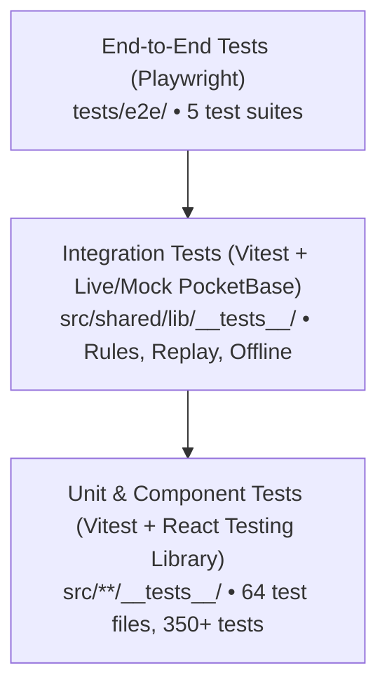

# Testing Architecture & Verification Guide

This document describes the testing strategy, test layers, configuration, execution commands, and guidelines for adding tests in the BinaaCost codebase.

---

## 1. Testing Pyramid Overview

The repository enforces software quality across three distinct testing tiers:



---

## 2. Unit & Integration Testing (Vitest)

Unit tests run inside a `jsdom` environment configured via [vitest.config.ts](../vitest.config.ts).

### Scope & Test Types
- **Pure Business Logic Tests**: Verified in `src/shared/logic/__tests__/` ([financials.test.ts](../src/shared/logic/__tests__/financials.test.ts), [calculations.test.ts](../src/shared/logic/__tests__/calculations.test.ts), [risk.test.ts](../src/shared/logic/__tests__/risk.test.ts), [versionCosts.test.ts](../src/shared/logic/__tests__/versionCosts.test.ts)).
- **Component UI Tests**: Rendered via `@testing-library/react` and `@testing-library/user-event` (e.g. `ProjectTabs.test.tsx`, `OverviewTab.test.tsx`, `ClientProposalReport.test.tsx`).
- **Hook & Cache Tests**: Testing custom React hooks with TanStack Query providers (e.g. `useProjectMaterials.test.ts`, `useOfflinePb.test.tsx`).
- **Offline & Replay Tests**: Testing queue management, transient errors, and ID remapping in `offline-replay.test.ts`.
- **Locale Parity Regression Test**: Automatically verifies key parity between English and Arabic translation dictionaries in `locale-parity.test.ts`.
- **PocketBase Access Rule Tests**: Live or mocked integration tests verifying security access rules in `integration-rules.test.ts`.

### Execution Commands
```bash
# Run tests interactively in watch mode
pnpm test

# Run full test suite once (CI mode)
pnpm test run

# Run tests with Istanbul code coverage analysis
pnpm coverage
```

---

## 3. End-to-End Testing (Playwright)

End-to-End tests verify complete user journeys using Playwright ([playwright.config.cjs](../playwright.config.cjs)).

### E2E Architecture & Setup
- **Base URL**: `http://127.0.0.1:8080`
- **Web Server**: Automatically starts `pnpm dev` on port 8080 if not already running.
- **PocketBase Prerequisite**: PocketBase must be running separately on `http://127.0.0.1:8090` (`cd pocketbase && ./pocketbase serve --dev`).
- **Browsers**: Tested against Chromium, Firefox, and WebKit.
- **Global Setup & Teardown**: Handled via `tests/e2e/globalSetup.cjs` and `tests/e2e/globalTeardown.cjs`.
- **Health Check Pre-flight**: Specs inspect `http://127.0.0.1:8090/api/health` before running. If PocketBase is not reachable, tests skip cleanly to avoid blocking unit-only environments.

### E2E Test Suites ([tests/e2e/](../tests/e2e/))
1. `auth-accounts.spec.ts`: User registration, login flow, token persistence, and sign-out.
2. `cost-library-redirect.spec.ts`: Confirms legacy routes `/resources` and `/cost-databases` redirect properly to `/cost-library`.
3. `offline-queue.spec.ts`: Disconnects network, enqueues item additions, restores connectivity, and verifies server persistence.
4. `public-share.spec.ts`: Tests the unauthenticated `/public-share/:token` flow, password gate verification, and risk redaction.
5. `share-links.spec.ts`: Verifies external link generation, expiration, and automatic link revocation when an editor's share is deleted.

### Execution Commands
```bash
# Run all E2E tests
pnpm e2e

# Run with interactive UI
pnpm exec playwright test --ui

# Run specific spec
pnpm exec playwright test tests/e2e/public-share.spec.ts
```

---

## 4. Writing Tests: Guidelines & Best Practices

1. **Isolation**: Every test must set up its own data and teardown state. Never rely on state left behind by a previous test.
2. **Deterministic Assertions**: Never use approximate float equality on currency values; assert exact decimal amounts (`1250.50`).
3. **Mocking Boundaries**:
   - Mock network boundaries using Vitest's `vi.mock()` or `msw`.
   - Never mock pure domain calculations (`financials.ts`, `math.ts`); test them with real logic.
4. **Accessible Selectors**: Query DOM elements by role, label, or text (`getByRole`, `getByLabelText`, `getByText`) rather than CSS classes or data attributes.
